<div align="center">

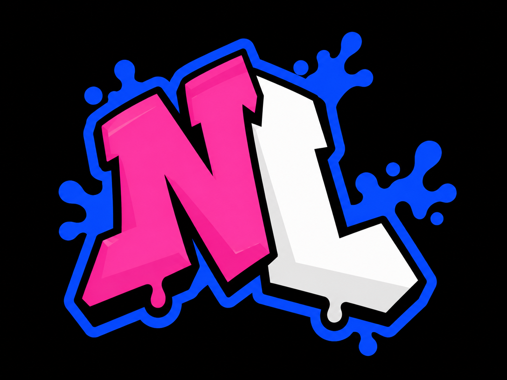

# Note Lab · FML Tool

**Your notes. Your HUD. Your custom-note behavior.**


[Get started](#get-started) · [Advanced guide · EN](docs/GUIDE_ADVANCED_EN.md) · [Guía avanzada · ES](docs/GUIDE_ADVANCED_ES.md) · [Screenshots](#the-base-game-inside-note-lab) · [Blocks & code](#blocks-and-code) · [Build](#build-and-test)

</div>

Note Lab is an independent FML tool built on its shared note-editing core.
It runs without installing the full suite. English and Spanish are included;
English is the default.

Create from your own images or remix individual components of an existing
style. Inspect the frames, try a chart, build behavior with blocks and export
an engine-specific package with installation instructions.

**Songs and imported-file audition have audio.** Only the block editor's
interaction cues are permanently muted, with no enable switch. Music volume,
pause and seeking remain available; OGG import/export is unchanged.
Tutorial cues are also muted; their sound files are not included.

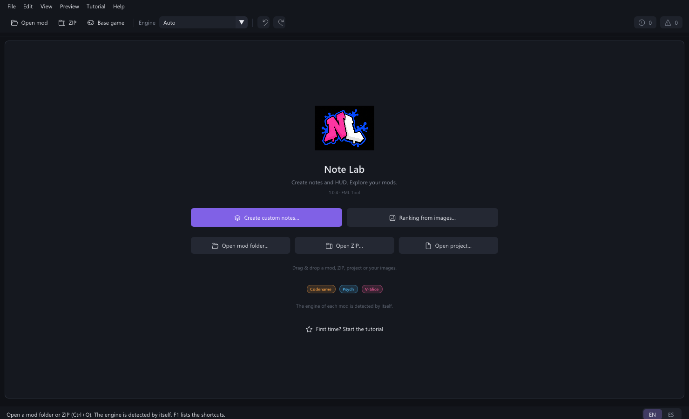

## Get started

Extract the **whole public ZIP**, keep `SDL3.dll` beside `NoteLab.exe`, and run
`NoteLab.exe`. Windows x64 and an OpenGL 3.3-capable graphics driver are required.
No Python, Haxe, Node.js or Visual Studio installation is needed to run it.

1. Choose **Create custom notes** to start from your own files, or open a mod
   folder, ZIP or `.fmlnote` project. Up to four sources can be open together.
2. Choose a style on the left. Preview, Custom notes and Assets use the same
   project. The inspector shows the selected style and its editable pieces.
3. Use **Combine styles / HUD** to take only notes, receptors, splashes,
   covers, ranking, countdown or sounds from another style. Combine several
   sources in successive steps without replacing the unselected groups.
4. Save your project with **Ctrl+S**. Your own custom notes go into the mod
   itself with **Save in the mod**, blocks included. Export a folder or ZIP for
   the chosen engine with **Ctrl+E**, then follow the generated installation guide.

New to the app? Accept **First steps**, or choose a guide from **Tutorial**.
Missions complete as you work in the editor. You can skip, resume or repeat
them. Guidance does not write into your mod automatically; saving a note or
copying a resource still requires your action.

## New in 1.0.4a

This maintenance release protects pending session recovery from a newer
autosave, rejects custom-note names that would overwrite another note's files,
and includes visual edits when checking whether a note needs saving.
Recovery is also available from **File** after opening a mod. Existing projects
and saved block comments remain readable.

Paint's **Shape** tool offers 12 thumbnail choices: rectangle, rounded
rectangle, ellipse/circle, triangle, diamond, star, arrow, heart, pentagon,
hexagon, trapezoid and cross. Drag to draw, or use **Place shape** to insert it
in the selection or chosen box on a new layer. Each shape remembers its
outline thickness and pixel-art option while editing; the note arrow retains
its standard outline.

## New in 1.0.4

### Your notes live in your mod

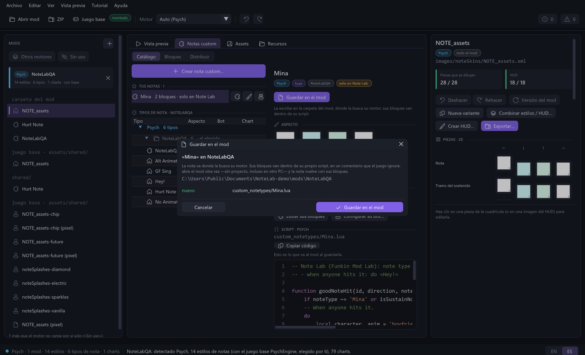

**Save in the mod** writes your custom note into the open mod folder, where its
engine looks for it (Psych `custom_notetypes/`, Codename `data/notes/`, V-Slice
`scripts/notekinds/`, plus its own look). Its blocks travel inside the same
script, in a comment the game ignores: open the mod again — no project needed,
even on another PC — and the note comes back with its blocks. The first save
lists every file, and a file Note Lab did not write is only replaced if you say
so. If the script is edited by hand later, Note Lab says so and lets you turn it
into blocks or keep the saved ones. Quitting with notes not yet in their mod
offers **Save them in the mod**, and the next start can recover the last session.

### Demo patterns you can edit

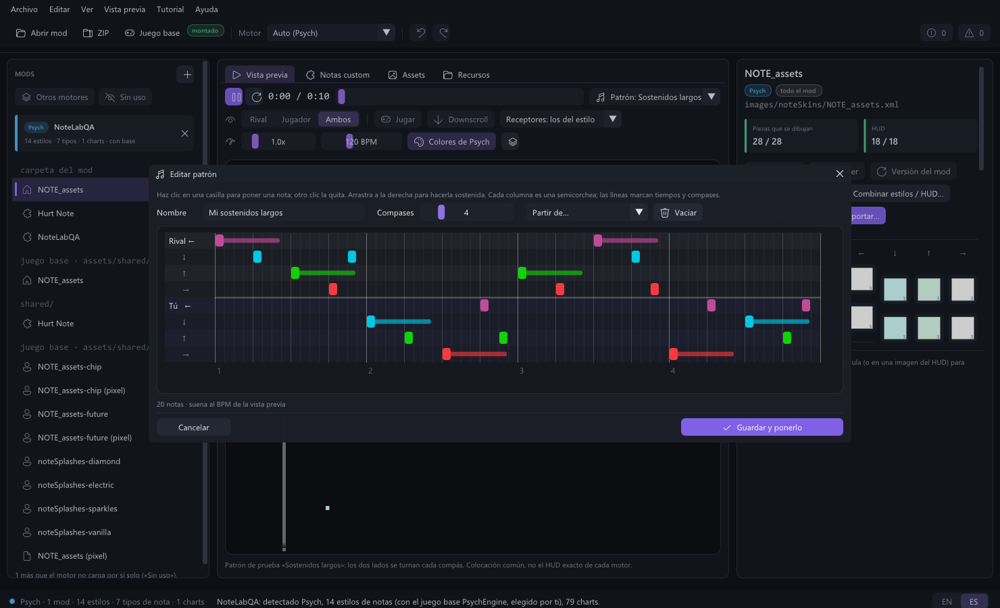

Seven demo patterns — Basic, Stairs, Jacks, Chords, Long holds, Stream and
Random — sit at the top of the song list. **Edit pattern…** opens a grid of
sixteenths to make your own (1 to 16 bars, holds by dragging), saved by name in
your preferences. **Distribute** works on a demo pattern too, to try custom
notes without a song; a demo pattern is never saved as a chart.

### Back to any tutorial mission

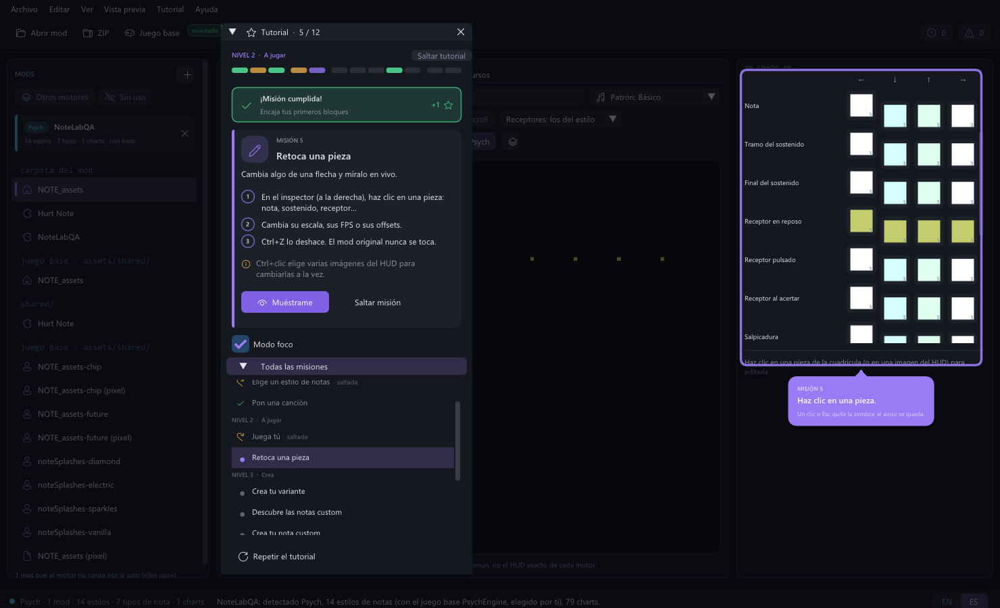

Missions you already passed — done, skipped, or jumped over because you had
them done — can be done again from **All missions** or the progress boxes. Note
Lab takes you to where the mission happens without touching your work; **Open a
mod** is the only one not repeated while a mod is open. Missions that need a new
note now guide you inside the **New custom note** window.

Also: clicking one of **Your notes** shows its overview (look, behavior, whether
it is in the mod, and its code for the mod's engine); **Go to the first** opens
the Preview right away; **Add screamer…** left the resources panel (the block
stays).

## New in 1.0.3

### Choose how to start drawing

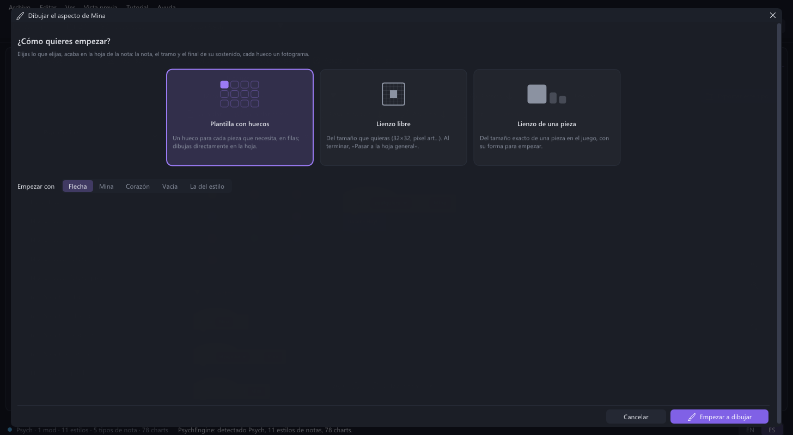

The sprite editor no longer drops you onto a sheet. Choose the **template**
with a box for each piece, a **free canvas** of your size (32×32, 64×64… up
to 512, with a pixel-art option) or the **canvas of one piece** at its game
size. Finish a free canvas and press **To the general sheet**: it is fitted
into the box without distortion, and pixel art grows by whole pixels.

The editor also gained right-click painting with the second color, Alt + click
to pick a color, `[` `]` for the brush size, `0` / `1` / `F` for the view,
mirror painting, a pixel-art brush and a shortcuts button.

### A note is saved first, then you decide

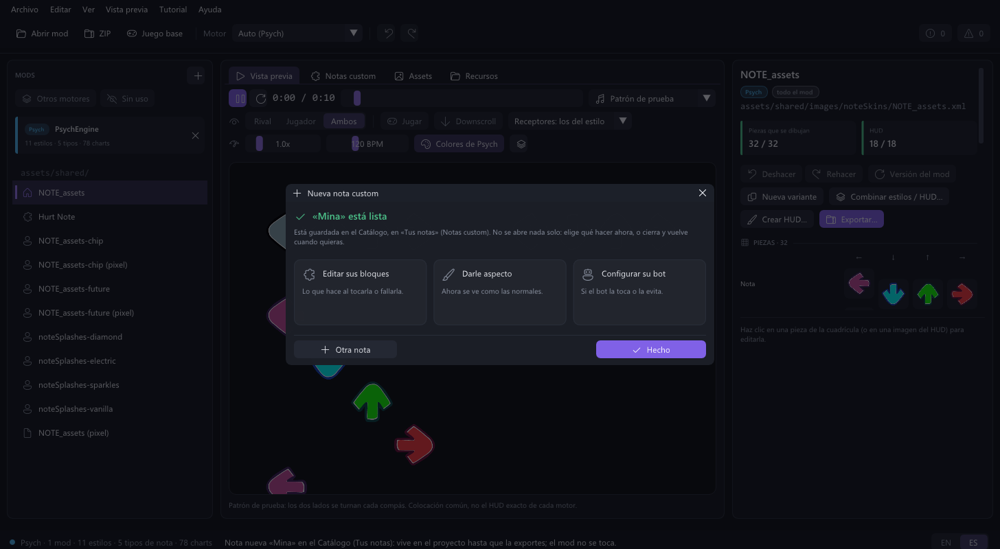

**Create custom note** uses cards and one **Create note** button. The note is
saved in **Catalog → Your notes** and the window shows **Ready** with the next
steps — edit its blocks, give it a look, set up its bot — instead of opening an
editor by itself. In Blocks, a second row keeps **Save**, **Save as**, **To
code** / **To blocks**, **Look** and **Bot** in view, with an unsaved-changes
marker.

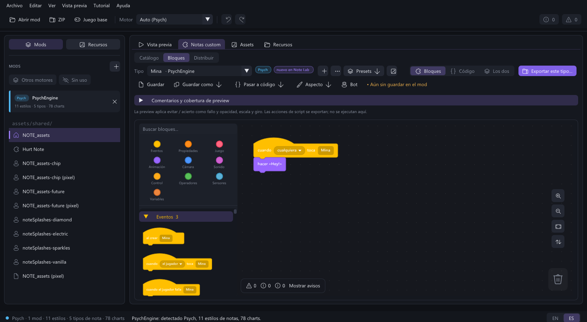

### Create note HUD, step by step

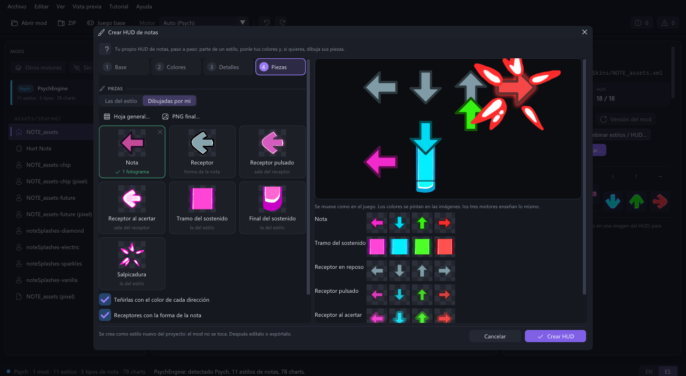

Base, Colors, Details and Pieces, with back and next. Pieces are cards with
their thumbnail; a click opens the editor on that piece. A style with its own
receptors now shows them in the preview as soon as you pick it.

## New in 1.0.2

### Draw the pieces, not just their colors

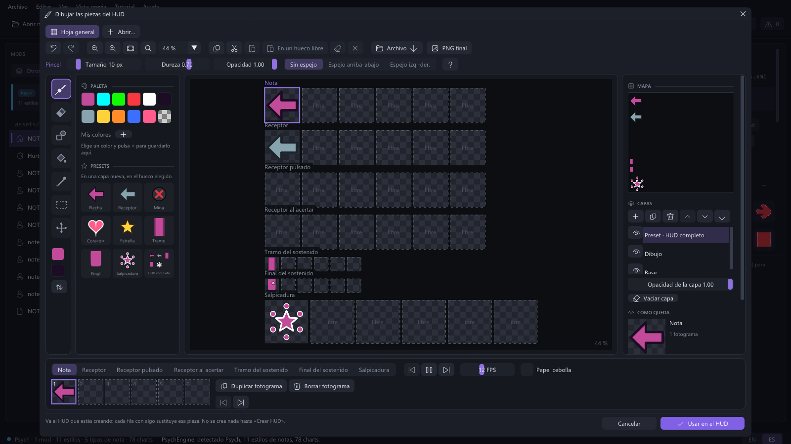

**Create note HUD → Pieces → Drawn by me** opens a layered sprite editor.
Draw notes, resting/pressed/hit receptors, holds, ends and splashes; leave a
piece blank to retain its donor. Paint, erase, fill, draw shapes, select ranges,
copy between tabs and animate on the frame timeline. The note-only look editor
limits itself to that custom note and its holds.

### Keep an editable drawing and inspect the final sheet

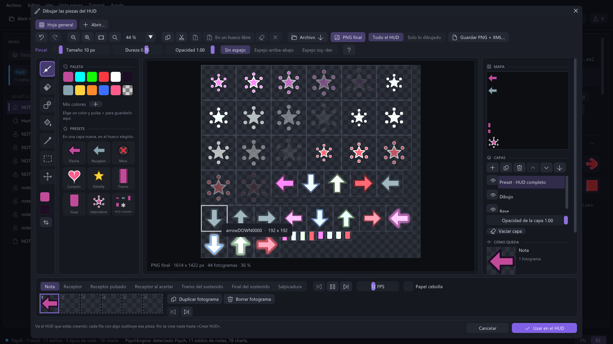

Save `.nlsprite` to preserve layers, frames, tabs and settings. **Final PNG**
shows the assembled sheet: all HUD pieces or only your drawings. **Save PNG +
XML** produces a flattened Sparrow sheet; it is not a replacement for the
editable drawing or the engine-specific export. **File → Save note sheet**
also assembles an existing style into one PNG/XML pair.

### Create one custom note from one assistant

**Custom notes → Catalog → Create custom note** collects its name, blocks or
code-only behavior, starting preset, look, hit sound and preview bot. A custom
note can keep the normal note graphics. **Your notes** distinguishes your work
from the mod's types. After creation, the **Ready** page lets you choose the
next step; creating from **+** in Blocks goes straight to that note's blocks.

The blocks **…** menu can import the selected type's script into blocks, save
or open `.nlblocks` programs, and save generated code in an engine-layout folder.
Script import is intentionally bounded: recognized statements become blocks;
other event code stays as engine-specific code blocks. Unsupported functions
are reported, not silently converted or claimed to work in another engine.

### Learn inside the real workspace

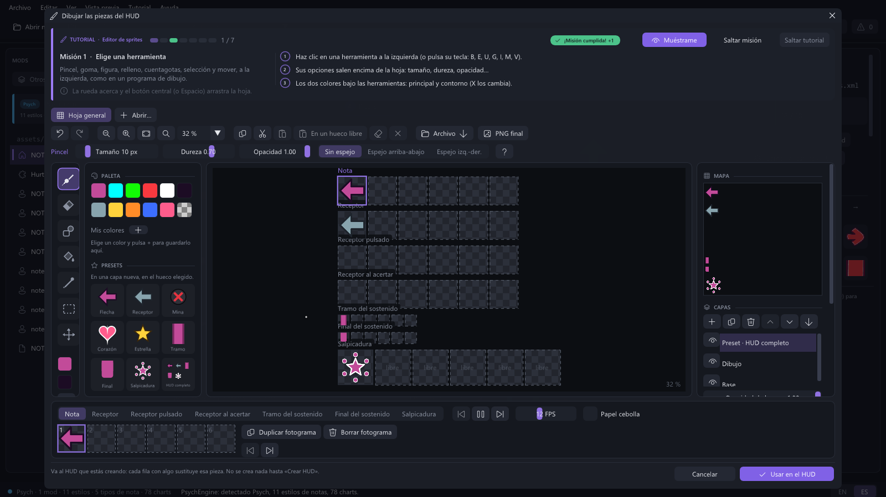

Seven guides cover first steps, blocks, HUD creation, custom creation/ranking,
resources, export and sprites. Focus highlights the relevant control; the
blocks guide demonstrates snapping actual blocks. Sound resources now separate
**Effects / Songs / Music**, with instrumental and vocal files grouped by song.

This release also fixes Psych 1.0 chart-side detection, differently painted
pieces sharing a Sparrow region, and one-frame V-Slice hit receptors getting
stuck. See the [complete changelog](CHANGELOG.md); the release verification
(`docs/RELEASE_CHECKS.md`) comes with the Developer ZIP.

## The base game inside Note Lab

These screenshots show Note Lab with locally installed base-game assets.
The game files are **not included** in either ZIP.

### Preview a chart and its HUD

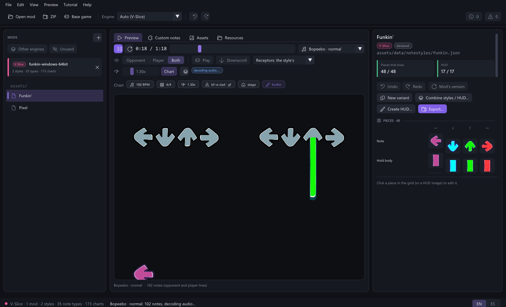

Inspect both sides, switch scroll direction and play the chart with its audio.
Separate note and receptor files remain separate components: a partial sheet
does not hide the base receptors.

### Inspect the actual spritesheet

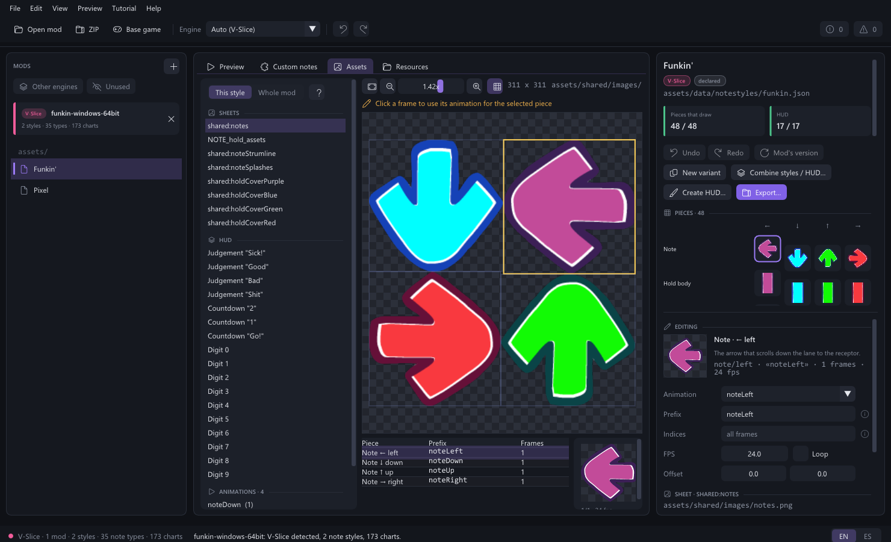

See the source sheet, animation bounds and frames before changing a resource.
The advanced creator accepts PNGs, XML/TXT sheets, sequences, manual regions
and grid cells instead of restricting you to a supplied template.

### Combine the pieces you need

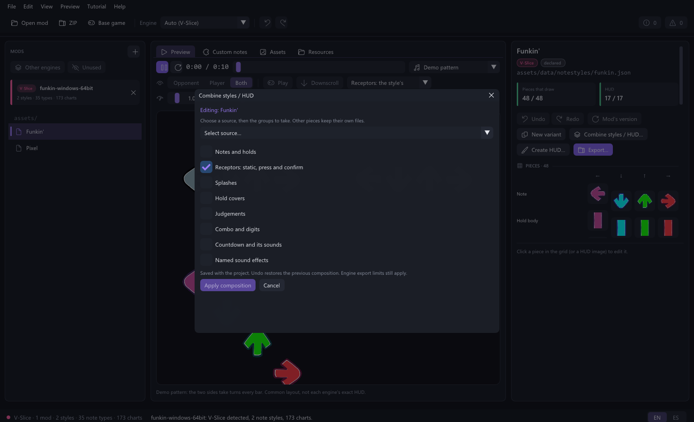

Take only receptors, notes, splashes, hold covers, ranking, countdown or named
sounds. The other groups stay unchanged; save the composition in your project.

## Blocks and code

Build custom-note behavior with blocks, edit the generated code with syntax
colors, then apply supported code changes back to the blocks. Comments and
drafts stay with the project. Unsupported code remains explicitly custom;
it is not silently shown as equivalent editable blocks.

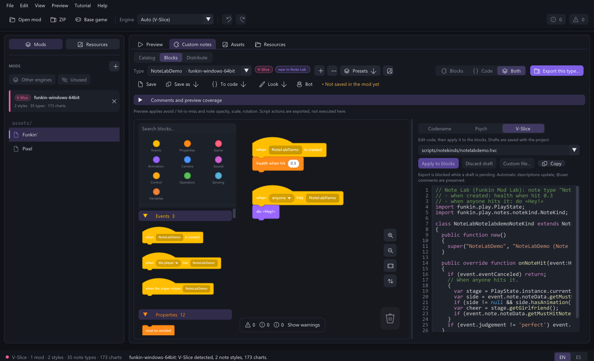

The block workspace keeps its media library in the **left sidebar**, not above
the canvas. Switch **Mods / Resources**, then **Library / In use**. Colored
image/video/sound filters, filename cards and connection/reference states keep paths
and missing dependencies readable without shrinking the editor.

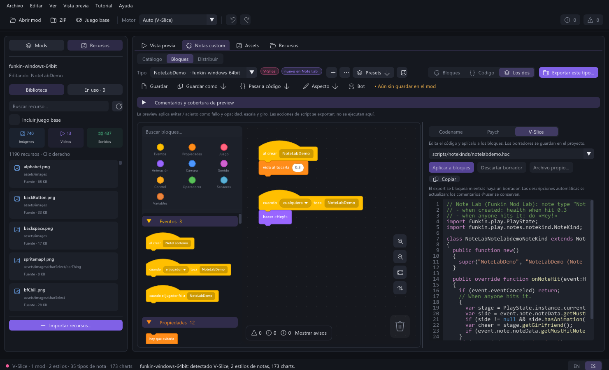

## Features

- Native Codename, Psych and V-Slice style, custom-note and chart readers.
- Categorized image/video/sound libraries in Resources and Blocks, search,
  contextual actions, explicit preview and a connected-block resource-use list.
- Full-length resource/import audio audition, opt-in Loop, playback speed,
  stereo balance and custom A–B loop ranges; preview settings do not edit files.
- Custom media import with inspection, destination folder creation, project-only
  or confirmed writable-mod copy, without overwriting existing files.
- Image, image-plus-sound screamer and video-overlay blocks with typed resources,
  duration, fit, opacity/volume and cooldown. Video preview uses the system player;
  target runtime support is conditional, not universally certified.
- Referenced PNG/OGG Vorbis/MP4 resources travel with note-type exports.
  Missing, incompatible or colliding resources block publication.
- Layered sprite painting, editable `.nlsprite` drawings, animation timelines,
  loose-drawing tabs, range selection and whole-HUD PNG/XML assembly.
- Basic painting and an advanced creator for PNG, XML/TXT atlases, PNG
  sequences, GIF inputs, manual crops/grid cells and OGG audio assignments.
- Independent notes, receptors, holds, splashes and HUD files. Partial note
  sheets retain base receptors in preview rather than making them disappear.
- Image-based ranking, countdown and named sound effects.
  Game assets must be supplied from your own installation.
- Custom-note blocks, presets, editable generated code, syntax colors,
  comments, bounded code-to-block synchronization and undo/redo.
- Deterministic custom-note distributions, exact quantities, filters and
  a per-type/per-side preview bot.
- Save a distribution as a native chart copy or explicitly replace a mod
  chart with a unique backup and an external-change check.
- Structurally checked folder/ZIP export for Codename, Psych and V-Slice, with engine
  capability warnings and English/Spanish installation instructions.
- Resizable panels, compact inspector tab, source-close confirmation and
  bounded, atomic `.fmlnote` saving with Unicode path support.

## Important limits

Song playback and imported-file audition are enabled. Block-editor and tutorial
cues are muted and have no enable switch. This does not mute songs, file
audition or sounds exported by your blocks. Playback volume, including a
deliberate mute, is saved in your preferences.

Preview is **not the game engine**: it does not execute arbitrary mod scripts
or simulate every exported block. The interface reports coverage. An export
passing structural re-reading is not a certification of in-game execution.

HUD layout offsets in the preview are **preview-only**, not a complete exported
HUD layout system. Native ranking/countdown images are static; animation is
not silently promised for engines that cannot express it. Audio export requires
OGG Vorbis. Per-note-type exports do not replace a whole strumline's receptors.

Projects reference source mods and cached imported/generated media. They are
**not portable bundles** yet. Do not delete or move those folders. Missing
source mods block opening without discarding the current project; missing
imported media is reported. Keep the project and its source/cache together.

Opening and previewing a source does not modify its assets. Writing into a mod
folder requires an explicit operation: **Save in the mod**, resource import
with **Copy to this mod**, or chart replacement. ZIPs and base-game files are
protected. Back up your mods before installing an exported package. Opening
assets does not grant permission to redistribute them.

## Build and test

The developer ZIP includes all required shared source and vendored libraries;
it does not need a sibling FML checkout. Install Visual Studio C++ x64 build
tools and a Windows SDK, then run:

```bat
build.bat
test.bat
test-workflow.bat
powershell -File test-ui.ps1
```

Output: `build/app/NoteLab.exe` and `SDL3.dll`. All units are rebuilt with
static C++ runtime linkage; no stale-object shortcut is used. The SDL DLL is
still required. `test.bat` runs synthetic core regression tests without mods.
The workflow test generates a broad creation/export/code matrix in `.qa/`:
six image-input modes, 16/32 cells, every component role, cross-engine exports,
all block presets, code/comment roundtrips and error handling.
The native UI test requires an OpenGL-capable desktop and the workflow fixtures;
CI builds the app and core tests, but does not claim graphics/UI coverage.
UI checks include the new-note assistant and its «Ready» page, sprite
persistence, the paint start screen, a free canvas sent to the sheet, the
Create note HUD steps, the tutorial flow (including going back to a mission),
saving a note into a copied mod and opening it again without a project, and the
pattern editor.

`test-engines.ps1 -Codename <folder> -Psych <folder> -VSlice <folder>` prepares
isolated game copies, leaving the originals untouched. Native launch is a
separate step: a successful copy or file re-read is not proof that a song ran.
The verification report, `docs/RELEASE_CHECKS.md` in the Developer ZIP, has the
actual results.

The developer kit is a **standalone Note Lab repository**. It does not include
the FML app, Atlas, the character/stage tools, the Psych importer or other labs.
`src/` is the desktop UI; `core/` contains the 14 note-editing modules;
`support/` contains only the source dependencies needed by this app (formats,
ZIP/files, rendering and audio interfaces). These dependencies are not another
application and cannot be removed without breaking the build. Existing `fml`
C++ namespaces are retained for compatibility, not because the suite is bundled.
Run `powershell -File test-layout.ps1` to check the standalone source layout.
`FML_SYNC_MAP.json` maps shared files to their original FML paths so that
improvements can be reviewed and moved back into FML without guessing.
The supplied logo is embedded into the executable and included
in `assets/`. `prepare-assets.ps1` rebuilds the multi-size Windows icon from
that original PNG; it does not generate new artwork.

The Developer ZIP also carries the architecture and module map
(`docs/MODULES.md`), the shared-core synchronization notes (`docs/CORE_SYNC.md`)
and the public-build verification (`docs/RELEASE_CHECKS.md`). See also the
[change log](CHANGELOG.md).

## License and contributing

Note Lab/FML source: [MIT](LICENSE). See [dependency notices](THIRD_PARTY_NOTICES.md).
The license does not include game/mod assets or system fonts.
See [contributing](CONTRIBUTING.md) and [security reporting](SECURITY.md).

## Español

Note Lab es una herramienta independiente de FML para crear, inspeccionar y
exportar notas y recursos del HUD. No necesitas instalar la suite completa.
La interfaz arranca en inglés; puedes cambiar a español y guardar la preferencia.

Las canciones y la audición de archivos tienen audio. Sólo los sonidos de
interacción del editor de bloques quedan apagados, sin opción para activarlos.
Volumen, pausa, desplazamiento e importación/exportación OGG siguen disponibles.
La 1.0.4a protege las sesiones pendientes de recuperación, evita que dos nombres
de nota sobrescriban los mismos archivos y detecta los cambios visuales al guardar.
Figura ofrece 12 formas con miniaturas, colocación en una capa nueva y controles
de grosor y pixel art por figura; la flecha conserva su contorno habitual.
La 1.0.4 guarda tus notas dentro del mod, con sus bloques en su propio script
(vuelven al abrir el mod sin proyecto), avisa al salir y recupera la sesión,
trae siete patrones de prueba y un editor de patrones, deja usar «Distribuir»
en el patrón de prueba y permite volver a cualquier misión del tutorial (menos
«Abre un mod» con un mod abierto).
La 1.0.3 añadió la pantalla «¿Cómo quieres empezar?» del editor de sprites
(plantilla, lienzo libre que se pasa a la hoja, lienzo de una pieza), controles
nuevos al pintar, el asistente de notas con página «Lista», Guardar / Guardar
como / Pasar a código en Bloques y Crear HUD por pasos. Los sonidos del
tutorial siguen silenciados y no se entregan archivos de sonido.
La 1.0.2 añadió tutoriales, editor por capas, piezas de HUD dibujadas,
`.nlsprite`, PNG final y conversión limitada de scripts a bloques.
Consulta el [inicio rápido en español](docs/QUICKSTART_ES.md) y la
[guía avanzada en español](docs/GUIDE_ADVANCED_ES.md) o
[en inglés](docs/GUIDE_ADVANCED_EN.md); los resultados de pruebas
(`docs/RELEASE_CHECKS.md`) van en el ZIP de Developer.
