# Note Lab · FML Tool — advanced guide

Edition: **1.0.4a**, 7 October 2026.

This guide covers the complete workflow: opening sources, inspecting assets,
creating notes and HUD pieces, combining styles, distributing custom types,
working with blocks and code, and exporting for a selected engine.

Keep this Markdown file beside its `images/` directory to read it offline.
Screenshots show Note Lab with locally installed V-Slice or Psych base-game
assets. Labels may be in English or Spanish. Game files are not included in
the download; use your own installation.

## Contents

1. [Scope](#1-scope)
2. [Installation and first launch](#2-installation-and-first-launch)
3. [Sources, styles and files](#3-sources-styles-and-files)
4. [Opening a base game or mod](#4-opening-a-base-game-or-mod)
5. [The workspace](#5-the-workspace)
6. [Inspecting a style](#6-inspecting-a-style)
7. [Preview and songs](#7-preview-and-songs)
8. [Holds, receptors and effects](#8-holds-receptors-and-effects)
9. [Combining styles and HUD pieces](#9-combining-styles-and-hud-pieces)
10. [Basic creation](#10-basic-creation)
11. [Advanced creation and import](#11-advanced-creation-and-import)
12. [Grids, regions and frame order](#12-grids-regions-and-frame-order)
13. [Assigning roles and animations](#13-assigning-roles-and-animations)
14. [Ranking, countdown and sounds](#14-ranking-countdown-and-sounds)
15. [The resource library](#15-the-resource-library)
16. [Importing custom resources](#16-importing-custom-resources)
17. [Creating a custom note type](#17-creating-a-custom-note-type)
18. [Working with blocks](#18-working-with-blocks)
19. [Images, sound, video and screamers](#19-images-sound-video-and-screamers)
20. [Resource usage and export resolution](#20-resource-usage-and-export-resolution)
21. [Variables, conditions and timers](#21-variables-conditions-and-timers)
22. [Editing code and synchronizing blocks](#22-editing-code-and-synchronizing-blocks)
23. [Comments and drafts](#23-comments-and-drafts)
24. [Distributing types in a song](#24-distributing-types-in-a-song)
25. [The preview bot](#25-the-preview-bot)
26. [Saving a chart safely](#26-saving-a-chart-safely)
27. [Projects, sources and cache](#27-projects-sources-and-cache)
28. [Engine-specific export](#28-engine-specific-export)
29. [Testing inside the game](#29-testing-inside-the-game)
30. [Complete exercises](#30-complete-exercises)
31. [Troubleshooting](#31-troubleshooting)
32. [Shortcuts and working habits](#32-shortcuts-and-working-habits)
33. [Development and current limits](#33-development-and-current-limits)
34. [Tutorials and focus hints](#34-tutorials-and-focus-hints)
35. [Drawing your HUD pieces](#35-drawing-your-hud-pieces)
36. [Shapes, layers, selection and frames](#36-shapes-layers-selection-and-frames)
37. [Editable drawings and the final PNG](#37-editable-drawings-and-the-final-png)
38. [Scripts to blocks and reusable programs](#38-scripts-to-blocks-and-reusable-programs)
39. [Effects, songs and music](#39-effects-songs-and-music)
40. [Format-specific checks](#40-format-specific-checks)
41. [Starting a drawing and free canvases](#41-starting-a-drawing-and-free-canvases)
42. [In-mod notes, recovery, patterns and tutorial navigation](#42-in-mod-notes-recovery-patterns-and-tutorial-navigation)

Coming from 1.0.4? Chapters 36 and 42 explain the new shape picker and save
protection. Coming from 1.0.3? Start with chapter 42. For your own artwork, use
advanced import (11–13) or the sprite editor (35–37 and 41). For a complete
custom note, start with chapter 17.

## 1. Scope

Note Lab edits note systems for Codename, Psych and V-Slice. A project can
contain visual styles, imported assets and custom-note block programs. Each
engine receives its own package format, not the same JSON renamed three times.

You can create notes, hold bodies and ends, receptors, splashes, ranking and
countdown assets. You can load charts, test readability and distribute custom
note types. Blocks generate behavior for those types.

Note Lab is not a full song, stage or character editor. Preview does not run
arbitrary mod scripts, translate every modchart between engines, or reconstruct
an editable FLA from an atlas.

Keep four operations distinct: **previewing**, **saving the project**,
**exporting a package**, and **testing that package inside a game**. Success
in one does not automatically verify the others.

## 2. Installation and first launch

Extract the whole Public ZIP. Keep `SDL3.dll` beside `NoteLab.exe`, and retain
the included asset and documentation folders. Windows x64 and an OpenGL 3.3
graphics driver are required. Running Note Lab does not require Python, Haxe,
Node.js, Visual Studio or the complete FML suite.


English is the initial language; **EN / ES** changes it. Start with your own
resources or open an existing game installation. For learning, open the base
game first; for editing, use a copy of your mod. You do not need to copy an
entire game into Note Lab's folder.

If Windows blocks execution, check the download's source, checksums and your
device's policies. Disabling security protections is not a normal installation
step. The Developer ZIP contains source and build dependencies, not the ready
application: choose Public if you only want to run the editor.

## 3. Sources, styles and files

| Term | Meaning |
| --- | --- |
| Source | A folder, ZIP or installation providing assets. |
| Style | A set of note, receptor and HUD components. |
| Sheet / atlas | An image plus metadata describing regions and animations. |
| Piece | One role, such as a left note, pressed receptor or hold body. |
| Custom type | The chart name that activates special visuals or behavior. |
| Block program | Behavior belonging to one note type. |
| `.fmlnote` | Note Lab's editable project and source references. |
| Export | Files prepared for installation in a selected engine. |

A style is not a custom type. Normal notes may use a complete style while a
special type has its own smaller look. Importing an image does not make it
appear during play: assign it to a piece or reference it from a connected block.

Likewise, a sheet containing notes does not necessarily contain receptors.
Check the components separately before deciding what needs copying.

## 4. Opening a base game or mod

Use **Open mod**, **ZIP** or **Base game**. Note Lab detects compatible layouts
and attempts to mount required base assets underneath the mod. Up to four
sources can be open at once.

Select the actual style in the source you want to edit. The latest opened mod
is not necessarily your current selection. Engine detection can be automatic
or explicitly overridden when the layout requires it.

If assets are missing, check the detected base installation. A source-code
checkout without its game assets is not a playable installation. Open the mod's
specific folder rather than an enormous parent folder such as Downloads.

ZIP sources are read through the virtual file system. To save notes, replace
a chart or copy resources into a mod, you need an editable folder destination.
Note Lab does not rewrite the original ZIP or a base-game source.

## 5. The workspace


The left panel lists sources and styles. The center has **Preview**, **Custom
notes**, **Assets** and **Resources**. The Inspector contains pieces,
diagnostics, composition and export controls for the selected style.

Drag separators to resize panels. In a narrow window, Inspector becomes a
center tab. Hiding a panel does not delete its contents.

**Preview** simulates notes and HUD pieces. **Assets** inspects the selected
style's sheets and frames. **Resources** catalogs mod images, videos and sounds,
including files not assigned to the note style.

In Blocks, the media browser lives in the left sidebar. **Mods / Resources**
changes the sidebar view; **Library / In use** switches between available
files and the current note's references. Switching views keeps the editor state.

## 6. Inspecting a style

Choose a style and inspect its engine, definition source and component counts.
A catalog entry can exist without usable animation frames.


Check the image and matching XML, TXT or other supported metadata. Regions
must fit inside the PNG, animations must resolve actual frames, and frame order,
FPS, loop, scale and offsets must match the intended piece. An inherited piece
may come from the base game rather than the mod itself.

Make a variant before experimenting if you want to compare with the original.
Undo restores editor operations; it is not a backup of external folders.

If an animation appears empty, investigate its image binding and regions before
changing the scale. A larger scale cannot repair missing metadata.

## 7. Preview and songs

Without a song, Preview uses a demo pattern. Seven built-in patterns and an
editable grid are available; see chapter 42. A pattern helps inspect pieces
but does not represent the density or timing of your song's actual chart.

Select song and difficulty to load chart notes. View the player, opponent or
both; try both scroll directions, holds and chords. Chart movement speed and
animation FPS are different settings.

Song playback has audio, pause, seeking and volume. Decoding may take a moment.
Block-editor interaction cues and tutorial cues are muted, with no enable
switch in this build. This does not remove sounds from your exported blocks.

**Play** lets you test input and scoring, but it does not execute arbitrary
scripts. A video block, for example, can remain a normal-looking note here
and play its video only in the destination game.

## 8. Holds, receptors and effects

Do not inspect only the four tap arrows. A mod can separate notes, receptors
and splashes into different files.

| Group | Check |
| --- | --- |
| Notes | Directions, frames, scale and offsets. |
| Holds | Body/end continuity, cropping and direction colors. |
| Receptors | Resting, pressed and hit-confirm states. |
| Splashes | Direction, variant, animation and alignment. |
| Hold covers | Actual support in the target engine. |
| HUD | Judgements, combo, digits and countdown. |

Partial sheets can show base receptors as a preview fallback. That avoids an
empty preview, but **does not add those receptors to the export**. Use
composition to include them in the edited style.

Selecting a style with its own receptors automatically shows them. The
**Receptors** selector can temporarily display another style's receptors; it
does not copy them. A custom-note-type export does not replace every receptor:
export a complete skin when that is your goal.

## 9. Combining styles and HUD pieces


Open **Combine styles / HUD**, choose a donor and select only the groups you
need. Unselected components remain unchanged. Apply one composition at a time
and inspect the result after each step.

For example, take notes from one source, receptors from a second and ranking
images from a third. They do not need to be artificially packed into one image
before editing. Separate sheet bindings are preserved.

When combining notes with separately stored receptors, check rest, press and
confirm in all four directions. Do not mistake the preview fallback for your
exported composition.

Referenced files from another source or ZIP are retained through the project
cache. Keep that cache and the source files while you need to edit the project.

## 10. Basic creation

The basic creator provides controls for quickly changing palettes, proportions
and shapes. It is useful for an initial look, but does not replace importing
your own artwork.

Choose a base, adjust the look, inspect all directions and receptor states,
then confirm to add the result to the project. If you export to another engine,
read warnings about scale or unsupported pieces.

You can also draw individual pieces in the layered sprite editor; see chapters
35–37 and 41. Use your own images for ranking, as described in chapter 14.
The text-based ranking creator is hidden in this build.

## 11. Advanced creation and import

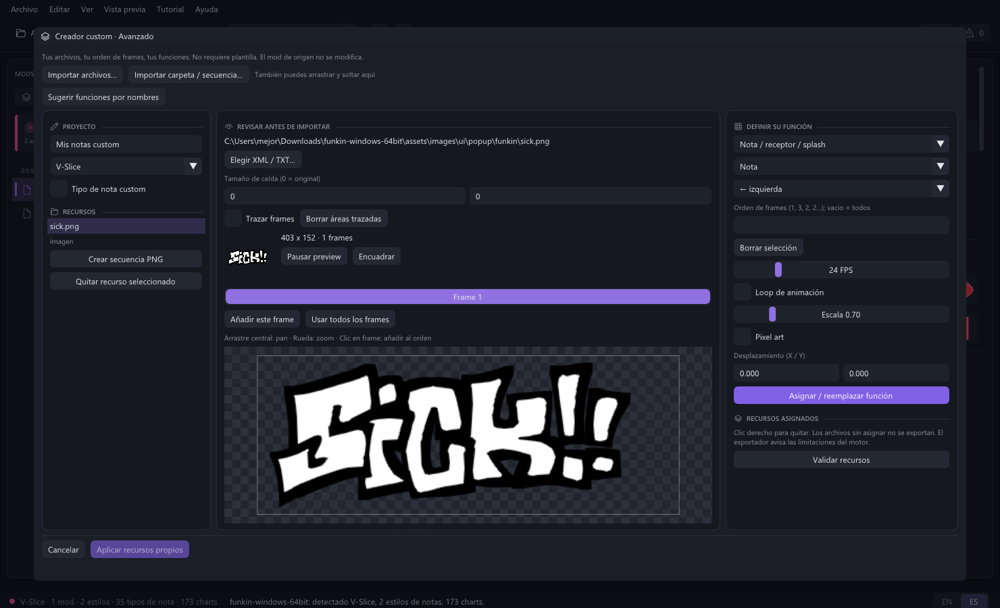

The advanced creator accepts images, sheets with metadata, sequences, manual
regions and audio. Import and inspect first; assign a role afterward.

1. Open the advanced creator and import files or a sequence.
2. Select the exact resource in the list.
3. Inspect its image, animation and warnings.
4. Define crops or a grid if metadata is missing.
5. Choose role, direction, variant and frame order.
6. Configure FPS, loop, scale, pixel art and offsets where applicable.
7. Add or update the assignment.
8. Check missing roles before confirming the style.

PNG/XML and PNG/TXT pairs need consistent image references. GIF is an input
format, not a claim that the engine will load a GIF as a note style. Export
converts the result into the target format.

Static ranking and countdown images normally require one frame. Animated
pieces require a real frame sequence; do not assign an entire sheet as one
region when the role expects separate frames.

## 12. Grids, regions and frame order

For a regular sheet, set the actual cell dimensions. A 32×32 grid is correct
only when the art follows that layout and spacing; the approximate size of a
character or arrow is not enough.

For an irregular sheet, trace manual regions. Each rectangle should contain
one frame without including its neighbor. Middle-drag pans the view; the wheel
zooms where the panel indicates it.

Frame order uses visible indices. `1, 3, 2, 2` produces four steps and repeats
the second frame at the end. Read the control's hint: in some selectors an
empty order means all frames, not no frames.

**Clear selection** clears the selected order, not the source PNG. Save or
update the assignment after changing it. Changing the visual selection alone
does not necessarily update a style already confirmed.

## 13. Assigning roles and animations

A role describes use: a left note and a left receptor can share similar art
but are different components. Assign the four notes first, then hold bodies
and ends, then receptor states. Add splashes and covers afterward.

FPS changes animation playback, not chart scrolling. Loop determines repeated
frames, but some Codename/Psych pieces have fixed timing rules. Read export
warnings when your settings need adaptation.

Offsets align art to its reference. Do not compensate for a badly cropped
atlas by arbitrarily increasing every offset. Pixel art changes filtering; it
does not restore detail lost in a blurry source image.

Check directions separately. A rotated asymmetric image can need different
alignment from a symmetric arrow, even when the source region is shared.

## 14. Ranking, countdown and sounds

Assign the judgement images **Sick**, **Good**, **Bad** and **Shit**, the combo
label and digits 0–9 to their individual slots. Do not combine all digits into
one frame if the engine expects each digit separately.

Countdown can have different images and sounds. Assign audio as a countdown
sound or named effect, not an image role, and audition it explicitly before use.

A named effect can be referenced by a sound block. Importing it does not
automatically trigger it; check the block's name and exportable file reference.

Preview positions are not a universal, engine-exportable HUD layout designer.
Check what the selected export actually writes. Static ranking/countdown roles
do not imply animated support in engines that cannot express it.

## 15. The resource library

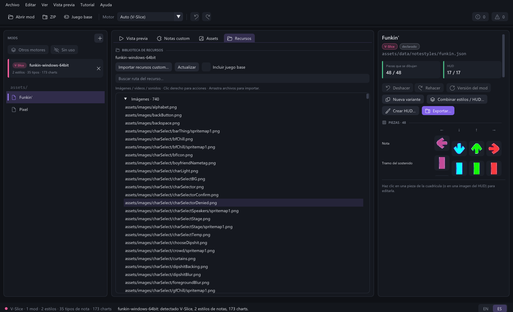

**Resources** organizes images, videos and sounds. Expand categories, search
by path, and enable **Include base game** when you need inherited resources.

In Blocks, use **Mods → Resources** or the resource button beside Presets.
**Library** shows the source containing the type being edited. **In use** shows
references from that type's blocks, with source and type identified above.


Cards show filename, folder, category and provider. Clicking a category filters
the list; clicking again clears that filter. Search works in both pages.

**In use** distinguishes found/connected, missing/ambiguous and disconnected
references. Right-click can select a referencing block or change its file.
These states describe a connection, not codec compatibility or successful
export. Hand-written code is not scanned for dependencies.

Right-click an asset to inspect it, open its folder, copy its path, use the
system viewer/player, or assign it to a compatible slot on the selected block.
Select a block first for direct assignment.

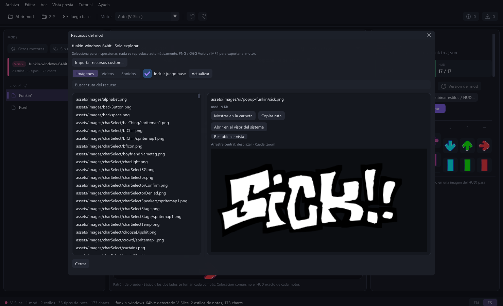

PNG preview supports pan and zoom. Images the preview cannot decode can be
opened externally. Video uses the associated Windows player; Note Lab does
not contain a general-purpose video decoder.

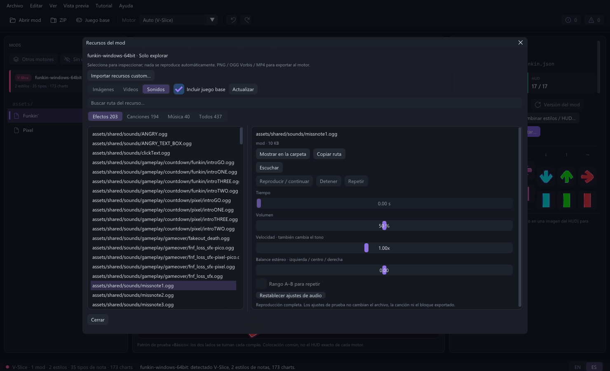

Selecting a sound does not play it. Use **Listen**, then pause, resume, seek
or stop. Audition is independent of the chart's song and allows the complete
file rather than a 30-second cutoff. Current audition input limit: 32 MB.

**Refresh** rereads the mounted catalog. If files added externally are not
indexed, reload the source; refreshing a list is not a full disk rescan.

## 16. Importing custom resources

Use **Import custom resources** in Resources or its block selector. You can
also drop supported files into the resource view. The dialog retains up to
128 selected files.

Select a file and inspect its image, audition its sound or open its video
before confirming. Category is inferred from extension; inspect to detect a
wrong or damaged input.

| Mode | Destination | Effect |
| --- | --- | --- |
| Project only | Note Lab cache and chosen virtual path. | Original mod/game/ZIP unchanged. |
| Copy to this mod | Editable mounted folder root. | Creates new files after confirmation. |

Project only is the default. Copying to a mod is explicit and unavailable for
ZIP sources or a source opened as a base game.

Choose a path **relative to the mounted root**, for example:

```text
images/custom/screamer/
sounds/custom/screamer/
videos/custom/
```

Do not enter an absolute drive path, `../`, or add `assets/` by habit. A mod
with packages may have its writable root inside the mod rather than beside
the game executable. Inspect the actual destination before copying.

Enable **Create destination folder if missing** when appropriate. Import
does not overwrite an existing file or invent an alternative filename.
Rename conflicting files or use another destination. Unsafe traversal,
reserved names and destinations crossing links/junctions are rejected.

Limits are 32 MB per image/sound, 128 MB per video and 256 MB per batch. If a
batch partly fails, retain and inspect the result: previous files are not
deleted or overwritten. Save the project after import.

Duration, volume, opacity and screen fitting belong to the block using the
asset. The selector can apply them during assignment; they are not inferred
from a filename. Use advanced creation for note-animation FPS and frames.

## 17. Creating a custom note type

Open a source, then **Custom notes → Catalog → Create custom note**, or **+**
in Blocks. The assistant collects name, behavior, starting preset, optional
look, hit sound and preview bot.

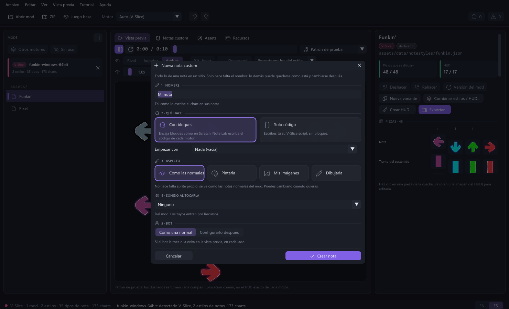

Choose **Blocks** or **Code only**. Code-only starts with the source engine's
event template. For the look, choose normal notes, painting, your images or
drawing. A custom type can use ordinary note graphics and only add behavior.

**Create note** adds it to **Your notes**. The **Ready** page offers the next
step—edit its blocks/code, give it a look or configure its bot—without opening
an editor automatically. Creating from **+** in Blocks goes to that note's
blocks. **Done** closes the assistant; it does not save files into the mod.


Click a row in **Your notes** for the overview: look, behavior, in-mod save
state and generated code. Row actions open its editors directly.

Configure these independently: chart type name, optional visual look, behavior,
and distribution into chart notes. Renaming a type may require updating charts.
Do not assume `Scare`, `scare` and an export filename are interchangeable;
follow the package's native ID instructions.

**Save in the mod** writes the type where its engine expects it. Saving a
project or copying code to the clipboard is not the same operation. The note
look editor draws only its note and holds, not the entire HUD's receptors.

## 18. Working with blocks


The palette contains events, properties, controls, operators, sensing, game
actions, animation, camera, sound and variables. Events head stacks; creation
properties belong in creation context. Connect actions to hit/miss events,
and values/conditions to compatible sockets.

A loose stack can be visible without contributing executable code. Blocks
must snap into a connection, not merely sit close together. Inspect warnings
and disconnected states after moving them.

Search the palette, expand categories, arrange or frame the workspace, and
use undo/redo for connections and values. Presets are starting points; inspect
them before exporting. Avoid notes and rewarding notes have different bot rules.

The note toolbar provides:

| Action | Result |
| --- | --- |
| Save | Saves the note, blocks and look into the editable mod folder; first save lists files. |
| Save as | Another note, an `.nlblocks` program, generated code in a folder, or a project copy. |
| To code | Converts this note to code-only, or makes a code copy while retaining the original blocks. |
| To blocks | Converts recognized script statements; unsupported portions remain explicit. |
| Look / Bot | Opens this type's visual or preview-bot settings. |


The state marker reports **saved in the mod**, **changes not saved in the mod**,
**not saved in the mod yet**, or **script edited by hand**. It is not the
project's Ctrl+S state. **Blocks / Code / Both** selects the editor view.

Engine diagnostics distinguish native data, scripts, approximations and
unsupported behavior. Generated code does not mean every effect runs in Preview.

## 19. Images, sound, video and screamers

Media sockets are typed: an image slot does not accept a sound and a video
slot does not accept a PNG.

| Block | Resource | Main settings |
| --- | --- | --- |
| Show image | PNG | Duration, opacity, fitting and cooldown. |
| Play sound | OGG Vorbis | File and volume. |
| Image + sound screamer | PNG and OGG Vorbis | Duration, volume, fitting and cooldown. |
| Play video | MP4 | Maximum duration, volume, fitting and cooldown. |

**Contain** preserves the complete image with possible margins. **Cover**
fills the screen and may crop. **Stretch** fills by distorting proportions.

For a screamer, connect the image-plus-sound block from Camera under a hit
event. Assign the PNG and OGG separately. Both references are required for a
complete effect. The old resource-panel shortcut is gone; the block remains.

Start with a short duration, moderate volume and a meaningful cooldown.
Effects reuse their overlay/timer instead of accumulating one per hit.
Screamer cleanup stops its sound; sustain pieces do not trigger new tap events.

Media durations are bounded to 0.05–30 seconds, volume/opacity to 0–1.
Showing an image does not animate an atlas: the complete image is shown.
Use note creation for animated pieces or a compatible video for a sequence.

Video needs the target build's supported script API and video implementation.
Psych may need Haxe enabled and its video library; Codename and V-Slice need
their compatible implementations. A `.mp4` extension does not verify its codec.
Note Lab reports limitations but does not install libraries into the engine.

Warn players about sudden effects, flashing and loud sounds. Editor audition
is deliberately manual so inspecting a file does not unexpectedly trigger it.

## 20. Resource usage and export resolution

**In use** groups the current type's block references and their connection,
missing-file or ambiguity states.

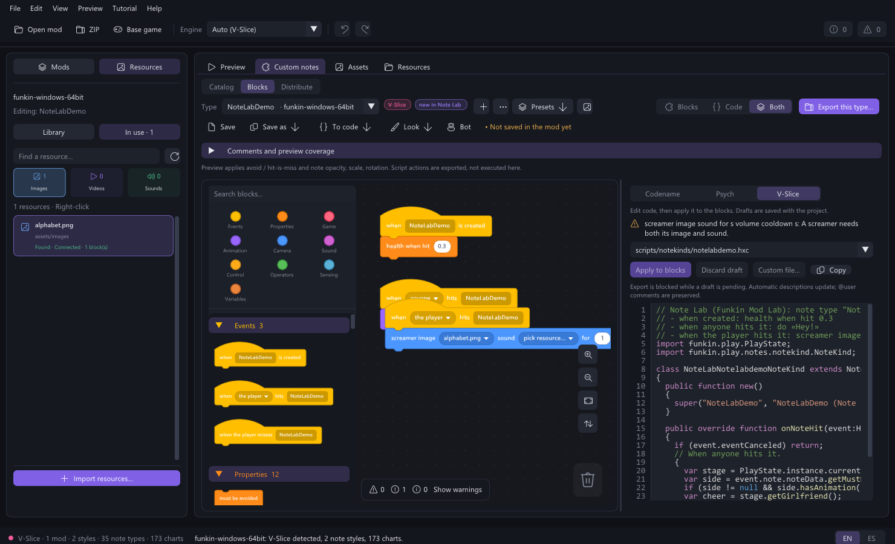

Hand-written code may require additional files not listed here. Track those
dependencies yourself; this is not a static analyzer for arbitrary scripts.

Export resolves the socket's reference through the mounted source, including
ZIPs; derives a native relative path under images, sounds or videos; includes
the file; and emits the matching engine key. Format, size and collision checks
run before publication.

```text
Virtual source: shared/images/custom/face.png
Exported file: images/custom/face.png
Code key: custom/face
```

The package does not depend on an absolute PC path. Project-only imports can
travel with the export as well.

These blocks export PNG, OGG **Vorbis** and MP4. Inspection of another format
does not make it exportable: convert it first. Renaming a JPEG to PNG or MP3
to OGG is not a conversion.

Missing files, incompatible formats or different content colliding at one
destination block publication. Identical content does not require duplicate
copies. Disconnected blocks contribute no media dependencies.

## 21. Variables, conditions and timers

Use a variable for values that must persist between hits of the same type.
Select its identity from the controls; changing a visible label should not
accidentally create a different variable.

Conditions can query direction, side, judgement, health, combo, time and other
supported values. Read sensor help: some values make sense only on a hit,
not on creation or a miss. An empty condition is not automatically true.
Test probabilistic behavior over enough notes, not one hit.

Loops and delayed tasks have execution limits. Do not create an update loop
by multiplying timers on every tap. Repeated effects need cooldowns.

Example:

```text
when the player hits Scare
  if direction is up
    image + sound screamer: 0.8 s, volume 0.4, cooldown 2 s
```

Connect the condition and effect inside the event body. Cooldown belongs to
the effect, not to chart note spacing.

## 22. Editing code and synchronizing blocks

**Blocks / Code / Both** refers to the same selected type. In Both, resize
the divider between canvas and editor. Select the engine whose file you edit.
Syntax colors and line numbers help reading; they do not validate the script.

After changing generated code, use **Apply to blocks**. Synchronization
recognizes the generator's supported constructs, not every Haxe/Lua file.

If an edit cannot be represented, keep a custom file for that engine or
discard the draft. A custom file replaces the corresponding generated
behavior; the previous blocks no longer fully describe it, and the UI marks that.

Export remains blocked while a draft awaits a decision. Saving the project
retains the draft; it does not apply it to the block program. Review unsupported
code before exporting to a different engine.

## 23. Comments and drafts

Generated descriptions update with the block program. Your comments are kept
separately from those automatic descriptions.

Select a block to edit its comment in **Comments and preview coverage**;
without a selected block, edit the type-level comment. Longer comments can be
edited in the code view.

Describe intent or conditions rather than repeating a block's label. For
example, “Player taps only; do not repeat within two seconds” explains more
than “Play sound.”

For custom scripts, document manual resources and required APIs. The block
resource list does not discover those dependencies automatically. Resolve
pending drafts before expecting an export to match the code you just typed.

## 24. Distributing types in a song

Load song/difficulty and open **Distribute**. Add custom types and choose a
percentage or exact quantity. A seed makes the distribution reproducible.
You can also distribute into a demo pattern for testing; patterns are not charts.

Compare eligible and assigned counts. Percentages apply to candidates that
pass the filters, not necessarily every note in the song.

Filters include player/opponent/both, lanes, excluding holds or chords,
minimum spacing and preserving/replacing existing custom types. If only a few
or zero notes change, inspect these filters and protected types before raising
the percentage.

An exact request for twenty notes cannot create twenty eligible candidates
when the filters leave fewer. Retain the seed and difficulty to repeat the
same experiment. Changing songs or patterns clears a distribution tied to
the previous chart; changing a demo pattern's BPM retains its distribution.

## 25. The preview bot

Open the custom bot from its button or the type's context menu. Configure
player and opponent independently to inherit, hit or avoid that type.

Use it to test different rules on your distribution. A harmful note marked
avoidable should not be treated as normal just because its sprite looks normal.

The bot simulates preview rules, not every script in the game. It does not
certify that a mod is beatable. Test manually as well, then inside the target
engine. Bot configuration is stored with the project.

## 26. Saving a chart safely

A distribution initially exists inside Note Lab. **Save distribution as chart**
writes it in the native format.

For the first test, save a separate copy. Replacing the original requires an
explicit choice and a unique backup. If the original changed externally after
loading, replacement is blocked.

Charts inside ZIPs and base-game sources cannot be replaced. Do not give a
JSON chart copy the original ZIP's filename.

Check song, difficulty and destination before saving. The chart backup does
not include images, block programs or the complete mod. Keep your project and
a separate mod backup too. A demo pattern cannot be saved as a native song chart.

## 27. Projects, sources and cache

**Ctrl+S** saves `.fmlnote`: edited styles, configuration, recipes, programs,
comments, drafts and import references. It is not yet a portable bundle of
every source file.

Keep the project, source folders/ZIPs and imported/generated-media cache.
The cache is under `%LOCALAPPDATA%/FunkinNoteLab`. Do not treat it as disposable
when a project refers to files stored only there. Moving a mod can break its
references.

Missing source folders block project opening without replacing your current
work. A complete reconnection assistant is not available yet. Give an export
to someone who needs a playable result; retain dependencies when sharing an
editable project.

Autosave recovery is separate from explicitly saved projects. See chapter 42
for retaining multiple pending sessions and recovering after opening a mod.

## 28. Engine-specific export

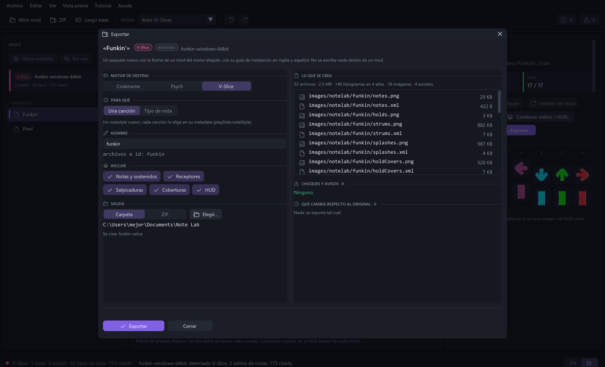

**Ctrl+E** prepares a style export; Blocks can export the current type.
Choose engine, package role and included groups, then read warnings before
selecting a folder or ZIP.

| Engine | Common custom-type behavior location |
| --- | --- |
| Codename | Compatible definitions/configuration and HX scripts under `data/notes/`. |
| Psych | Configuration and Lua scripts under `custom_notetypes/`, plus supported visual resources. |
| V-Slice | Style data and NoteKind HXC scripts under `scripts/notekinds/` when applicable. |

These explain behavior paths, not every installation detail. Follow the guide
generated for **your package**. A skin, custom type and HUD do not necessarily
install the same way or replace the same files.

Export may adapt scales, timing or visuals the engine cannot declare directly.
Some functions are approximations or unsupported. Retain those warnings when
distributing a mod.

Note Lab builds and rereads its package before publishing. Missing required
assets or structural errors block publication. Rereading does not run every
script. Existing destinations are replaced only when recognized as a Note Lab
export and safety checks pass; do not export over an unrelated mod folder.

Keep `INSTALL.txt`, `LEEME_INSTALAR.txt` and the manifest. Test in a separate
engine copy before installing into your main mod.

## 29. Testing inside the game

1. Prepare a separate test installation or mod.
2. Install according to the generated instructions.
3. Verify the chart's custom-type name/native ID.
4. Play taps, holds, normal/custom types, hits and misses.
5. Observe receptors, splashes, ranking and countdown.
6. Test pause, restart and song end with active effects.
7. Inspect game logs for missing assets or unsupported APIs.
8. Test videos with the actual codec and engine build you distribute.

Automated checks for this release are distinct from recorded gameplay on
5 October 2026 in Psych 1.0.4, Codename 1.0.1 and V-Slice 0.8.6. Those games
checked specific HUD, custom-note, hold and block examples; they were not
replayed for 1.0.4a. They do not certify every multimedia block or engine version.
The Developer ZIP's `docs/RELEASE_CHECKS.md` records coverage and boundaries.

## 30. Complete exercises

### A. Learn without editing the base game

Open the base game, select Funkin' and Bopeebo Normal. Inspect a note's frames
in Assets. Change preview settings, make a variant, save a project and export
into a test folder. Do not copy over base-game assets.

### B. Separate notes and receptors

Open a note sheet and a style containing the desired receptors. Combine only
receptors. Check rest, press and confirm in all directions. Export a complete
skin and inspect both source bindings; preview fallback is not enough.

### C. A visual custom note with behavior

Create TestNote, assign a look and a simple preset. Distribute a small exact
quantity on the player side with a fixed seed, preserving existing types.
Save a chart copy, export the type and verify its native ID in the game.

### D. An image-and-sound effect

Create Scare and connect a screamer block. Assign PNG and OGG Vorbis from
Resources, with duration 0.8 s, volume 0.4 and cooldown 2 s. Inspect In use,
export and check the image/sound files. Test the effect in the engine.

### E. Your own resource without changing the mod

Import your PNG in Project only mode under `images/custom`. Inspect and assign
it to a block, then save the project. Export should include the file while
the original mod remains unchanged.

### F. Optional video

Import a compatible MP4, test it in the system player, and assign it to a
rare test note. Use moderate volume and a bounded duration. Read API warnings,
install and play it before claiming support for that engine version.

## 31. Troubleshooting

| Symptom | Check |
| --- | --- |
| No styles found | Correct source folder, assets present, engine and base source. |
| Invisible receptors | Separate sheet, prefixes, composition and preview fallback. |
| Empty animation | Correct image/metadata, regions in bounds and valid frame order. |
| Only one frame | Static HUD role, FPS, selected sequence and saved assignment. |
| Few custom notes | Filters, protected types, sides, spacing and eligible count. |
| Bot hits a harmful note | Type rules and per-side hit/avoid profile. |
| No sound | Volume, decoding finished, supported file and explicit Listen action. |
| No sound when moving blocks | Expected: editor interaction cues are muted. |
| Screamer has no sound | Assigned OGG, valid reference and installed type export. |
| Video absent in-game | Codec, API/build, script support and package path. |
| Import does not create a folder | Create destination folder option and writable root. |
| Existing import file rejected | Choose another name or destination. |
| Export blocked | Read errors; decide drafts and resolve missing/incompatible resources. |
| Project will not open | Restore source/cache dependencies; keep current work. |
| Works only in Preview | Preview is partial; check native IDs, formats and APIs. |
| Note name rejected | Another name produces the same export filename; choose a distinct name. |

Report Note Lab version, engine/build, resource/type/difficulty, minimal steps
and the actual warning. Share a small permitted example rather than a whole
private or commercial mod.

## 32. Shortcuts and working habits

**Ctrl+S** saves the project. **Ctrl+E** prepares export. **Ctrl+Z / Ctrl+Y**
undo/redo where supported. Middle-drag pans canvases; wheel zoom is available
where indicated.

Keep stable type/resource names, use dedicated folders and avoid ambiguous
duplicates or hidden dependencies that work only on your PC. Test one piece,
type and song first, then combine. Save before closing or reloading sources.
Do not expect an undo history to survive a new session.

Use chart copies and isolated engine installs for validation. Keep project,
editable drawing and playable export as separate products.

## 33. Development and current limits

Developer contains Note Lab source, its note-editing core and required
dependencies, not the full FML suite. `src/` is UI; `core/` contains models,
readers, creation, blocks, persistence and export; `support/` contains reused
dependencies. `docs/MODULES.md` maps files and scripts, while `FML_SYNC_MAP.json`
maps shared paths for reviewed transfer of changes.

Build needs Visual Studio C++ x64 tools and a Windows SDK. `build.bat` builds
the application; `test.bat` checks the core; `test-workflow.bat` checks native
flows; `test-ui.ps1` checks controls. Use private fixtures, not original games
as writable test destinations.

The code's MIT license does not relicense game assets, mod art or system fonts.
Screenshots are documentation, not a redistributable asset pack.

Current limits include portable source bundles, complete arbitrary-script
execution in Preview, universal code/block conversion, identical cross-engine
HUD layout export, universal multikey support, integrated video decoding and
automatic analysis of custom-code dependencies.

Developer includes `docs/RELEASE_CHECKS.md` for verified results and
`docs/NEXT_IMPROVEMENTS_ES.md` for proposals. Proposals are not implemented
features or release commitments.

## 34. Tutorials and focus hints

**First steps** has twelve missions covering source selection, songs, playing,
creation and saving a note into the mod. Zone guides cover Blocks, Create HUD,
custom creation/ranking, resources, export and sprite editing.


Accept the initial card or use **Tutorial → First steps**. Perform the task
in the editor; state detection completes it. **Show me** frames and scrolls
to the relevant control. Click or Esc removes the shade; an outline/hint may
remain until completion, and dragging temporarily hides it.

You can skip missions, resume, repeat or re-enable zone offers. Passed missions
can be revisited from **All missions** or progress boxes; see chapter 42.
First steps has priority over zone guides, avoiding simultaneous instructions.

The play mission asks for three hits, then returns Preview to automatic mode.
The Blocks guide demonstrates damage, healing and luck with real blocks. Its
focused palette can be expanded with **Show all**. It requests a new note
instead of building over existing work.

Tutorial guidance does not write into the mod automatically. A mission involving
Save in the mod still requires your explicit save action. Tutorial sounds are
muted; music and file audition remain available.

## 35. Drawing your HUD pieces

Open a base style and **Create HUD**. Move through **Base**, **Colors**,
**Details** and **Pieces** with Back/Next or the numbered steps.


Choose **Drawn by me** to show piece cards. Selecting the mode does not open
the editor; click a piece card to edit it after choosing how to start.

| Row | Purpose |
| --- | --- |
| Note | Moving tap head. |
| Receptor | Resting fixed arrow. |
| Receptor pressed | Press without a hit. |
| Receptor on hit | Hit confirmation. |
| Hold piece | Repeated/stretched sustain body. |
| Hold end | Sustain tail. |
| Splash | Splash effect. |

The general sheet has six frame boxes per row. A row left undrawn retains its
base piece; blank does not mean deleting that HUD component.


Draw the left direction. Notes and receptors can rotate into other directions;
check asymmetric art. Direction tint uses luminosity to preserve outline and
highlights while applying lane colors. Inspect all four results, not just
the original untinted drawing.

Use **Receptors with the note's shape**, or draw receptor states independently.
The app can derive pressed/hit states and animate a single-frame splash;
draw multiple frames for your own sequence.

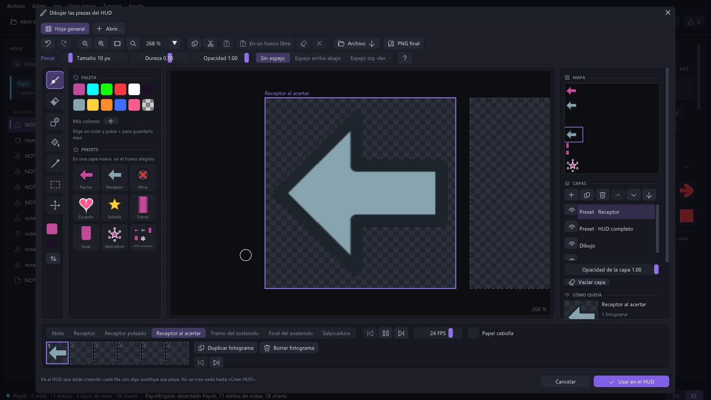

**Use in the HUD** returns drawings to the creator. Confirm **Create HUD**
to produce the style; reopening it retains its drawing recipe.

For one special note, use **Change its look → Draw it** in Catalog or Blocks.
That editor contains note/hold rows, not all HUD receptors.

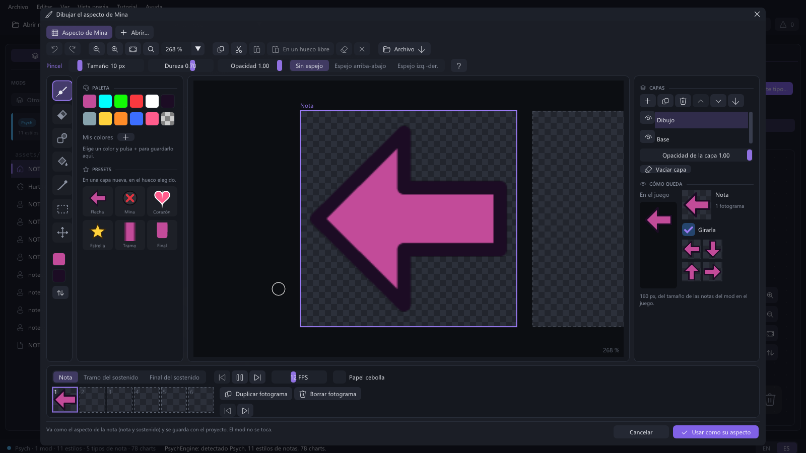

## 36. Shapes, layers, selection and frames

Start on a drawing layer. Brush and eraser have size, hardness and opacity.
Fill uses tolerance; Picker copies colors. Presets are added on another layer
inside the chosen region without replacing all previous artwork.

### Choosing and placing real shapes

Choose **Shape** or press **U**. The upper toolbar changes to a thumbnail
selector with twelve shapes:

| Choices | Choices | Choices |
| --- | --- | --- |
| Rectangle | Rounded rectangle | Ellipse / circle |
| Triangle | Diamond | Star |
| Arrow | Heart | Pentagon |
| Hexagon | Trapezoid | Cross |

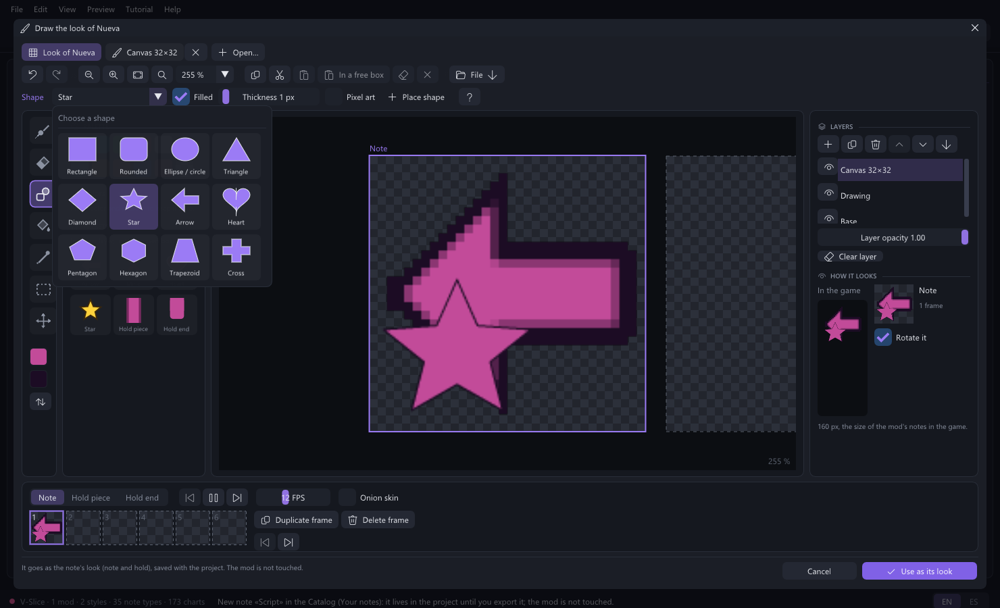

Select a figure, then drag on the canvas to set its dimensions. **Place shape**
centers it in the selection or chosen box on a new layer, which can be moved
or undone. Notes and HUD presets remain separate from these drawing shapes.

**Filled** controls the interior. **Thickness** sets outline width from 0 to
32 pixels; the note arrow retains its standard outline and disables that
control. **Pixel art** removes edge smoothing; a pixel-art canvas already
enforces it. Each figure remembers thickness/pixel-art settings during editing.
Saved drawings retain pixels, not vector objects for later parameter editing.

### Drawing shortcuts

| Shortcut | Action |
| --- | --- |
| B / E | Brush / eraser. |
| U / G / I | Shape / fill / picker. |
| M / V | Range selection / move. |
| X | Swap main and secondary colors. |
| Ctrl+C / X / V | Copy / cut / paste selection. |
| Ctrl+A / D | Select all / clear selection. |
| Ctrl+Z / Y | Undo / redo. |
| Delete | Clear the selected range on the active layer. |
| Wheel | Canvas zoom. |
| Middle-drag or Space-drag | Pan. |
| Shift + brush/eraser click | Straight line from the previous point. |
| Right-click | Paint with the secondary color. |
| Alt + click | Pick color with any tool. |
| [ / ] | Brush size; with Shift, hardness. |
| 0 / 1 / F | Whole sheet / 100% / chosen box. |

Use **?** to inspect shortcuts. Mirror options reflect strokes vertically or
horizontally. Pixel-art brushes avoid smoothing and show the pixel grid up
close. Do not use canvas shortcuts while typing in fields.

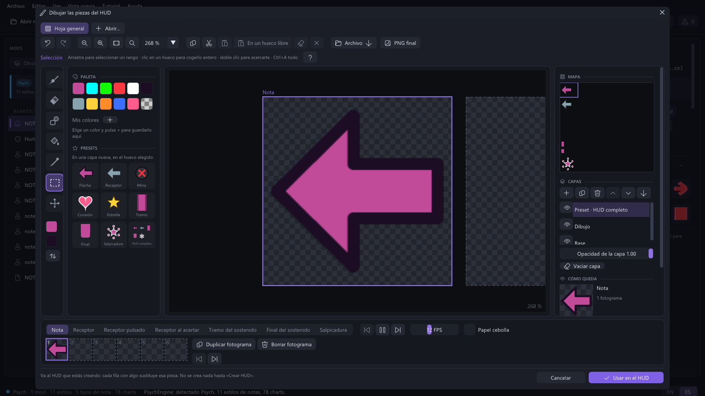

Layers support adding, duplication, names, visibility, opacity, reordering and
merge down, up to sixteen layers. Merge flattens them; save `.nlsprite` first
if you need the separate originals. Artwork on another layer can remain visible
after clearing the active layer.

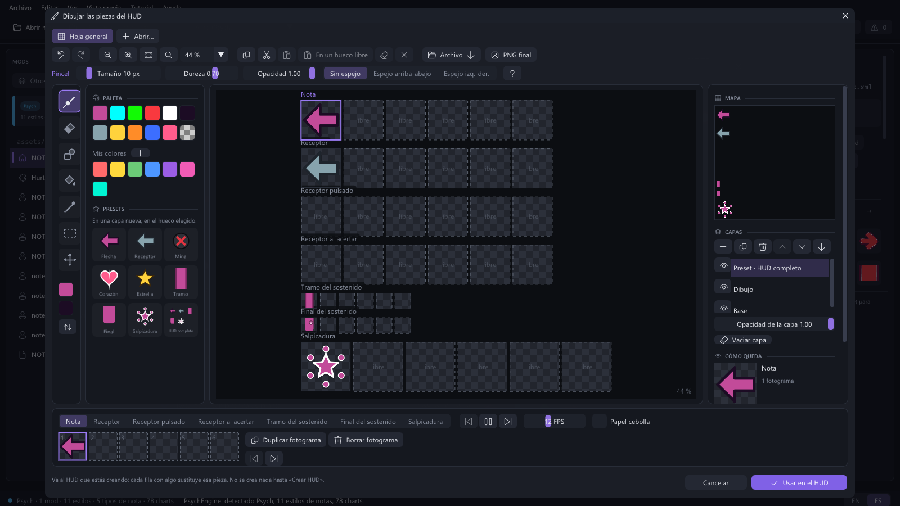

**My colors → +** stores the main color in preferences; right-click removes
it. This palette is not part of the exported mod.

The timeline belongs to the selected row. Choose frames, play, set FPS, use
onion skin, duplicate/delete/reorder, or paste a region into a free frame box.
Deleting pixels is different from **Delete frame**, which removes a frame slot.

Tabs contain loose drawings, isolated pieces or references. **To the general
sheet** moves a loose piece into its row. **File → Open sheet** accepts PNG
with XML/TXT, images, GIF or `.nlsprite`; **Load from the style** extracts
pieces without editing source files.

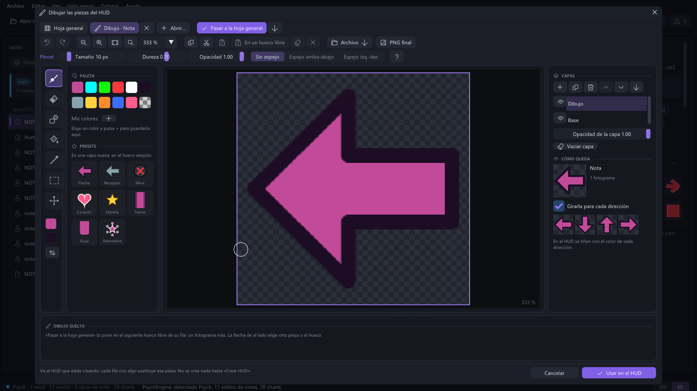

Use zoom presets and the map on large sheets. The editor recomposes modified
regions when painting; avoid duplicating enormous layers merely to add a frame.

## 37. Editable drawings and the final PNG

Keep two different products if you will continue editing:

- **Save drawing → `.nlsprite`** retains layers, names, visibility, opacity,
  tabs, frames and settings.
- **Final PNG → Save PNG + XML** produces a flattened Sparrow sheet without
  editable layers, for inspection or another tool.

Using a drawing in a note/HUD retains its editable reference with the recipe.
That reference may live in cache; `.fmlnote` is not self-contained. Save your
own `.nlsprite` separately for an explicit reusable backup.

Opening a drawing alongside existing work adds a tab rather than overwriting
it. In **Whole HUD**, Final PNG combines base and drawn pieces. **Only the
drawn** limits it to your drawings. Hover frames to inspect names and bounds,
including holds, receptor states and splashes.


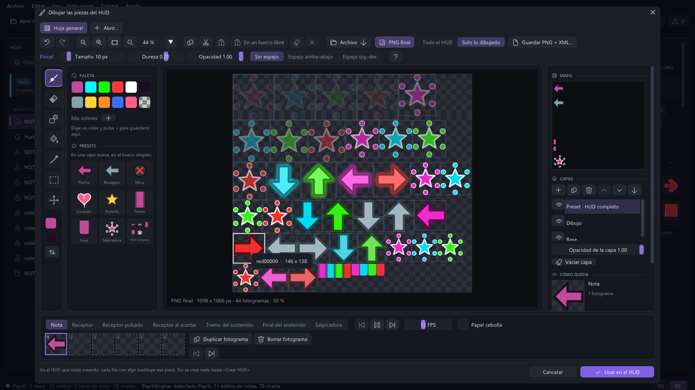

**File → Save note sheet (PNG + XML)** also packs an existing style, including
multi-sheet compositions, into one sheet. It does not reconstruct original layers.

A PNG/XML pair does not create scripts, skin registration or NoteKind
definitions by itself. For game installation, use the engine export and its guide.

## 38. Scripts to blocks and reusable programs

Select a type and use **Blocks → … → Turn its script into blocks**. Read the
report: recognized statements, preserved code and unsupported functions.
The source mod script is not modified.

Recognized patterns include health, score, misses, combo, sound, shake, flash,
Hey, messages and certain Psych note properties. This is not a general
Haxe/Lua interpreter or decompiler.

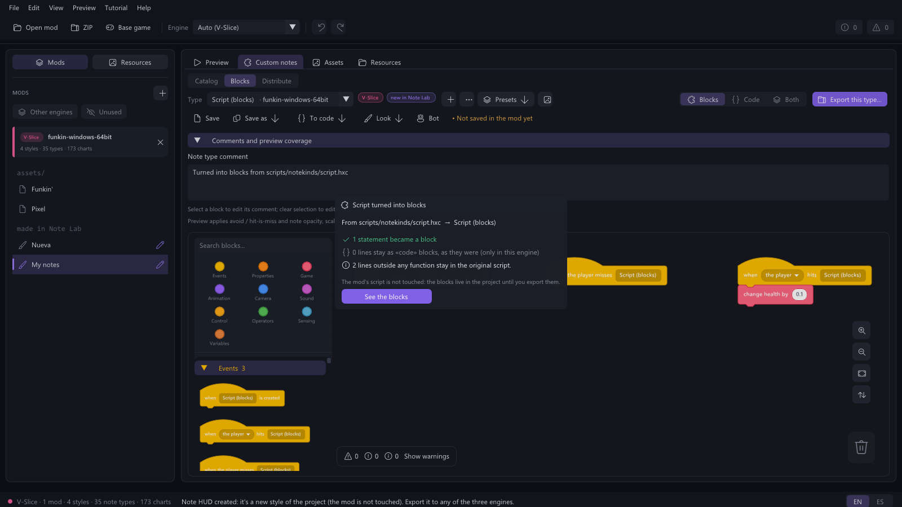

| Result | Required review |
| --- | --- |
| Recognized block | Values, connections and event. |
| Code block | Original line and engine. |
| Unsupported function | Keep/review the script separately; it is not a note event. |
| Texture declaration | Assign a look and its actual resources. |

Unrecognized lines inside supported events retain their place as code blocks.
They emit only for their original engine; another engine receives comments
and a warning, not equivalent executable behavior. Empty code also warns.
Preserved text is not proof of compilation or preview execution.

When a type already has blocks or is code-only, conversion creates another
`Name (blocks)` type rather than deleting the original. Use its corresponding
chart ID if you choose the new type.

**Save block program (.nlblocks)** enables reuse. Opening into an empty type
loads it; opening into an existing program adds stacks beside the current
ones. Recheck connections/resources. The file does not bundle media automatically.

**Save its code in a folder** uses native paths—Codename `data/notes/*.hx`,
Psych `custom_notetypes/*.lua`, V-Slice `scripts/notekinds/*.hxc`—but does not
replace exporting dependencies. Generated-code draft synchronization and
external-script conversion are different workflows.

## 39. Effects, songs and music

In Resources, choose Sounds. **Effects** is the initial filter. **Songs**
groups instrumental/vocal files by song; **Music** contains files under
`music/`. Classification applies to all three engines. Include base providers
when the mod inherits resources.

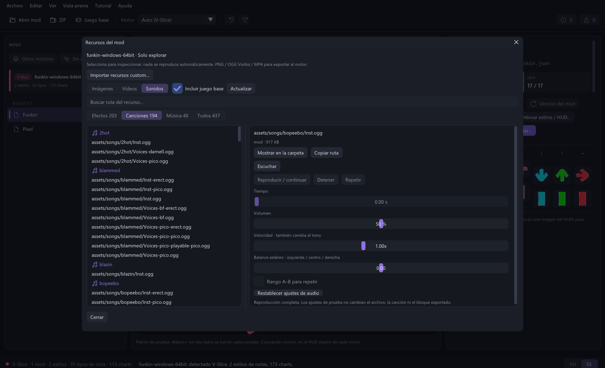

Selecting does not play. Inspection, audition and external folder opening are
explicit. Search the full path when filenames match and inspect the active provider.

**Loop** repeats the complete auditioned file, or only the enabled **A–B** range.
Speed is 0.25×–2× and also changes pitch; stereo balance supports left/center/
right, including mono input. Mark A/B at the current position or adjust them.

Pause retains position. Stop returns to the start, or A for an active range,
and cancels pending playback. Reset clears loop/range, restores 1× speed and
center balance, but retains volume. A different file resets its A–B range.

These settings do not edit the resource, chart transport or exported sound
block. A file in the library does not automatically become Preview's song:
use the song selector for that separate playback system.

## 40. Format-specific checks

Before distributing a mod:

1. In Psych 1.0, check both sides: `psych_v1` uses absolute lanes and
   `mustHitSection` controls camera, not swapping the player's side. Psych
   exports use classic lanes that modern engines convert.
2. For Psych RGB templates, check all hold colors. Differently painted shared
   Sparrow regions receive copies; grids/strips retain their first-owner limit.
3. A single-frame V-Slice confirm receptor exports with two references to the
   same region so it can return to rest. Check bot and opponent states.
4. Play multiple automatic laps: taps and hold heads should return without
   retaining the previous lap's hit/miss state.
5. Save/reopen drawing and project; inspect layers, frames and references.
   Try an export under a folder containing accents too.
6. Play the package in the exact engine version you distribute. Retain warnings:
   a valid PNG does not validate its script.

The Developer release report separates automated checks, extracted-package
tests and historical gameplay evidence.

## 41. Starting a drawing and free canvases

The sprite editor asks **How do you want to start?** rather than placing you
directly on a sheet. The resulting drawing eventually goes into a note/HUD
frame box.


| Choice | Result |
| --- | --- |
| Template with boxes | One row per piece; arrow, mine, heart, empty or style-based start. |
| Free canvas | Chosen size, presets 16×16–256×256 or custom up to 512, with pixel-art mode. |
| One piece's canvas | The actual game-size piece as a starting reference. |
| Continue | Existing layers, frames and tabs if you already drew. |

A free canvas opens in its own tab. **To the general sheet** adds it as a
note in the next free box. The adjoining arrow chooses another role or a
specific box, replacing that box. A different size is fitted without stretching
proportions; pixel-art scaling uses whole-pixel steps. Inspect the indicated
final size.

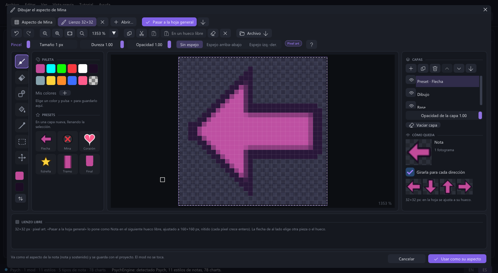

Draw a 32×32 note, send it to the sheet, and inspect it with its hold in
**In the game**. **+ Open → Free canvas** adds another without deleting the
general sheet. The note-look editor shows its hold and four directions in
the right panel; the general-sheet map is used for whole-HUD drawing.

## 42. In-mod notes, recovery, patterns and tutorial navigation

### Save your note into its mod

A created note lives in the project until **Save in the mod** in its overview,
or **Save** in Blocks. It writes the source engine's expected note paths plus
the look, if one is assigned. First save lists files and destinations.


Blocks are stored in a comment inside the script that the game ignores.
Reopening the mod without a project, including on another PC, restores the
note and its blocks in **Your notes**.

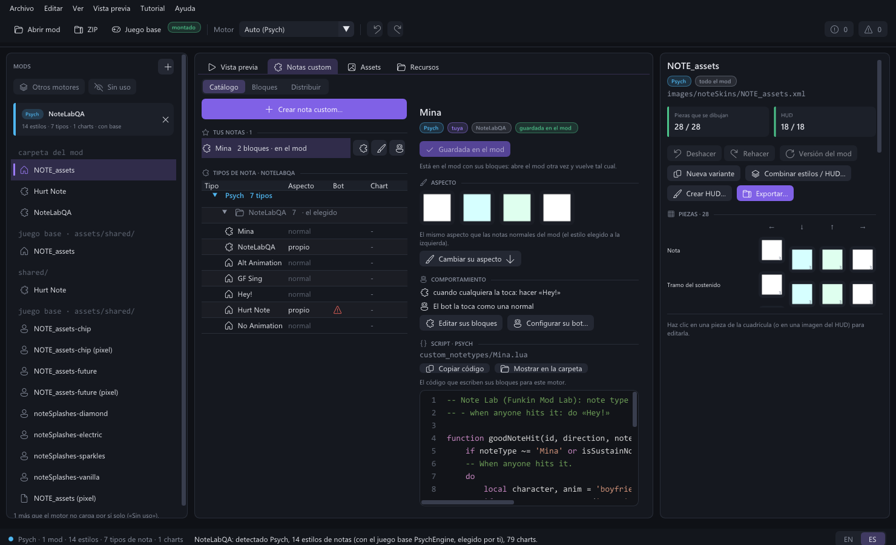

Saving into a ZIP or base-game installation is prohibited. Existing files not
recognized as this note's own files require explicit replacement approval.
If the script was edited by hand anywhere outside its embedded comment, the
overview reports it. Choose script-to-block conversion or the saved blocks;
resaving an edited script requires approval.

Two distinct names cannot target the same files. `Fire Note` versus
`Fire-Note`, case-only aliases and Windows-sanitized filenames may collide.
Choose a genuinely distinct name; this protection also applies to older projects.

Embedded metadata now identifies its owning note. Files owned by another note
are not silently treated as yours. Older comments remain readable; unrecognized
legacy ownership requires explicit replacement approval.

Changing scale, animation or frame definitions marks the note as changed even
if its look ID is unchanged. Saving also includes the look declared by an
imported note. Project saving and in-mod saving remain separate.

### Recover without replacing another pending session

Closing with unsaved notes offers **Save them in the mod**. A recovery copy
is kept for the next start. Pending recovery is stored separately from the
active session's autosave: opening another mod or saving another project does
not delete it.

Use **File → Recover previous session** even after opening a mod. Unsaved
work prompts before replacement. Recovering an older session also preserves
the displaced current session. Discarding a recovery does not delete the
active autosave. Recovery is not a substitute for project and mod backups.

### Editable demo patterns

The song list begins with Basic, Stairs, Jacks, Chords, Long holds, Stream and
Random. **Edit pattern** opens a grid: opponent above, player below, one
column per sixteenth and one to sixteen bars.


Click to add a note, click again or right-click to remove it. Drag right to
make a hold, stopping before the next note on its lane. **Start from** copies
a built-in pattern; **Clear** empties the grid.

**Save and use** stores a named pattern in preferences, up to 32 patterns,
and plays it at Preview's BPM. Reopening edits that saved pattern; **Delete
pattern** removes it. Distribute works here too, but **Save distribution as
chart** is unavailable because a pattern is not a song chart.

### Return to tutorial missions

Starting/continuing a tutorial skips tasks already complete and marks that
fact. **All missions** distinguishes skipped tasks from completed ones.
Click a passed mission or progress box to revisit it: the editor navigates
to its tab, view or Create HUD step without modifying your work.


If its condition is already satisfied, complete it again with another song,
style or action, or choose **Next mission**. **Open a mod** is not repeated
while a mod is open. New-note missions guide inside the assistant itself.

For additional version history, see the [changelog](../CHANGELOG.md). The
[Spanish advanced guide](GUIDE_ADVANCED_ES.md) covers the same workflows.
