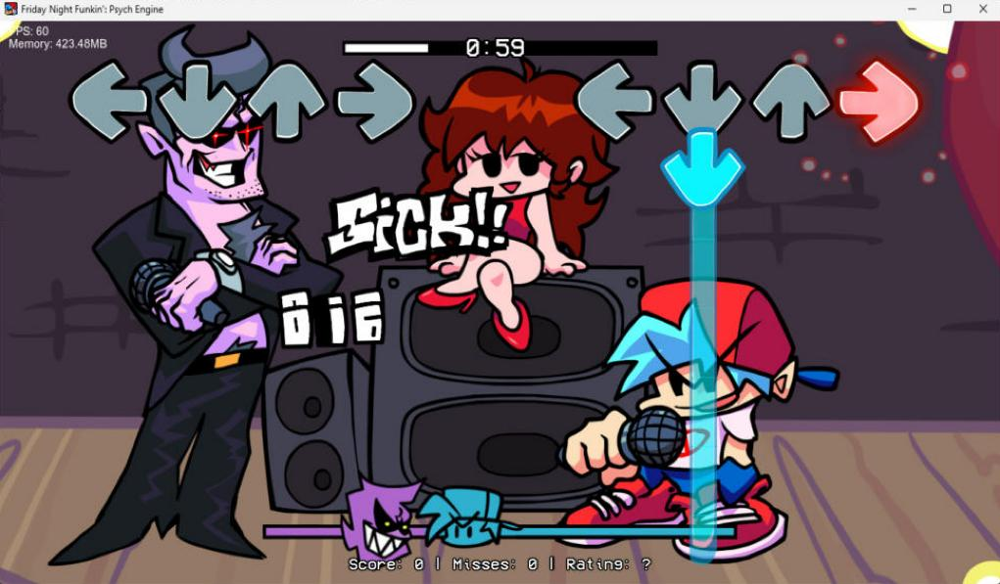
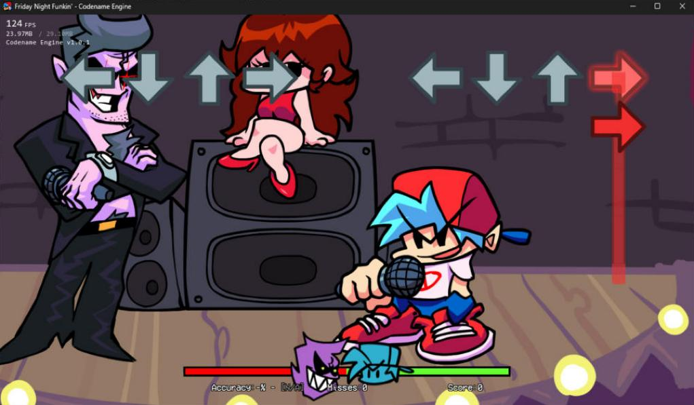
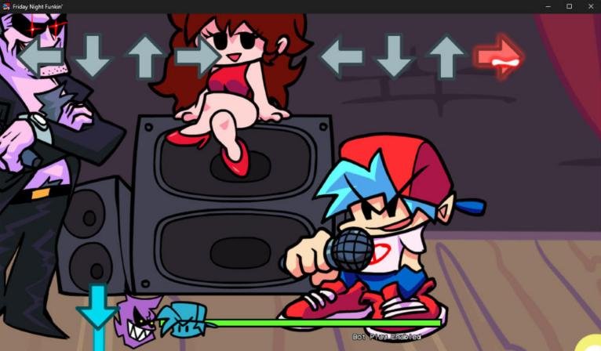

# Note Lab 1.0.3 release verification

Release date: **2026-10-06**. This report separates the checks repeated for this
release from native game observations recorded earlier. Previous deliveries
are preserved. Closing tests read isolated copies of the three selected game
installations; projects, exports, media fixtures, preferences and logs stay
under private QA directories.

1.0.3 changes the application's windows only. The note-editing core, the
supporting libraries and the exporters are byte-identical to 1.0.2; the core
test file only gained a path fix in its fixture writer (below).

## Fresh automated checks

| Suite | Passed | Coverage |
| --- | ---: | --- |
| Shared core | 714 | Styles, charts, projects, creation, drawn sheets, code/block conversion, media and export regressions. |
| Native workflow / three-engine matrix | 2,148 | Creation, display, composition, import, distribution, save/reopen, all block presets, audio and export/reread checks. |
| Native UI | 135 | Real in-app controls, resource sidebars, colored code editor, new-note assistant and its «Ready» page, paint start screen, free canvas sent to the sheet, Create note HUD steps, tutorials, sprite workflows and compact layout. |

**2,997 checks passed with zero failures**, plus a separate missing-program guard
that rejects an incomplete UI test cleanly. The workflow and UI suites ran on
the final executable after its last source change; the core suite ran again
after the last test-file change.

The fresh matrix used isolated copies of these installations:

| Engine | Discovered styles | Charts |
| --- | ---: | ---: |
| Codename 1.0.1 | 4 | 67 |
| Psych 1.0.4 | 11 | 78 |
| V-Slice 0.8.6 | 2 | 169 |

The isolated V-Slice copy lists 169 charts; the 1.0.2 run reported 173. The
number is what this run found, not an adjusted figure. Logs are retained
privately as `release-1.0.3-core.log`, `release-1.0.3-workflow.log` and
`release-1.0.3-ui.log`.

### What changed in the UI checks

`--ui-test=notes` grows from 22 to 28 checks: the assistant creates the note
in the Catalog and shows «Ready» without opening an editor, «Edit its blocks»
reaches the blocks, the sprite editor shows «How do you want to start?», a
32×32 pixel-art free canvas reaches the general sheet (more than 2,000 inked
pixels, three layers), Create note HUD moves through its steps and its piece
cards open the editor on their piece.

### Found and fixed while closing the release

- **Crisp pixels in the sprite editor.** A capture of a 32×32 pixel-art canvas
  at 1,353 % was smooth instead of blocky. The bundled ImGui OpenGL3 backend
  binds its own linear sampler, which overrides a texture's own filter. The
  canvas now requests ImGui's nearest-sampler draw callback while zoomed in or
  on pixel art, and returns to linear after it. Verified by a new capture.
- **Labels.** The script-to-blocks report said «1 statements became blocks»;
  it now uses the singular. Two hints still named «Into the general sheet»
  after the button became «To the general sheet».
- **Core tests in an accented folder.** Compiling the Developer ZIP in a folder
  named «José» made 65 core checks fail and the run abort. The test helper that
  writes fixture sheets built paths with `fs::path(u8string)`, which Windows
  reads as ANSI, so the images landed in a «José» folder. It now uses
  `fs::u8path`; 714/714 pass with «José» in the temporary path. The application
  opens the same fixture from «José» and «ñandú» folders exactly as from an
  ASCII one. **Still open:** with the whole Developer kit inside a «José»
  folder, 13 export checks fail (exports re-read and verified under that path).
  That code is unchanged since 1.0.2 and was not investigated for this release.
- **Test scripts.** `test.bat` called `NoteLabCoreTests.exe` without a path,
  which fails when Windows does not search the current folder; it now uses the
  full path. `test-ui.ps1` and `capture-demo.ps1` read exit codes reliably in
  Windows PowerShell 5.1, and the UI total is counted from the logs.

### Tutorial sounds

Silenced for this build at the author's request: the tutorial cue policy is off
in `BuildPolicy.hpp`, so no mission, ending or offer sound plays. The «Sounds»
switch is hidden in the tutorial window and the Tutorial menu (checked on
native captures). Neither package contains `.wav` files, a `sounds/` folder or
the sound generator; the packager rejects them. Song playback and file
audition are unchanged; block-editor cues stay off.

### Coverage and test boundaries

Creation checks cover individual images, sequences, sheets, XML/TXT, grids,
manual regions, every note/HUD role, frame ordering, FPS/loop and missing input.
Drawn pieces cover shared-region recoloring, editable recipes, a mounted sheet,
`.nlsprite` saving/reopening and target-engine export/reread.

Code checks exercise presets and engines, editable comments, syntax-color spans,
supported code/block roundtrips, script-to-block conversion and palette entries
in EN/ES. These tests do not execute every block in every game.

Every discovered style is drawn at three sizes, both scroll directions and three
side modes. Native chart/project save/reopen uses Unicode paths. Exports cover
source/target/role combinations, dependency preflight, missing files, destination
creation and repeated ZIP publication under accented paths.

Real engine instrumental/vocal files are decoded and checked for non-silent
PCM, playback progression, pause, seeking and volume persistence. Synthetic
OGG/MP4 header fixtures prove pipeline validation, not codec or native video
playback. Test media is not included in either delivery.

UI checks use the app's own frame/input harness, without Computer Use or OS input
injection. They include compact 1024×768 and standard 1480×900 layouts.

## Native game observations recorded on 2026-10-05

These are the game tests recorded during 1.0.2 development, not a claim that
the games were played again for 1.0.3. They remain relevant because the core
and exporters that produce the packages are unchanged. The original observations
and cleanup are documented in [BITACORA.md](../BITACORA.md). Game screenshots
below are native captures, not Note Lab's simulated preview.

| Engine/version | Observed package and result |
| --- | --- |
| Psych 1.0.4 | Bopeebo Hard with 30% custom notes, a neon HUD based on the RGB template, holds in their four lane colors, splashes and custom-note actions. Tested as a song skin with `arrowSkin` and `disableNoteRGB`; a mod-global skin can otherwise be recolored by Psych and export warns about that. |
| Codename 1.0.1 | Drawn HUD, holds, star splash, custom notes and flash. A private CPU observer needed its opponent-hit callback adapted; that observer is not part of the shipped export. |
| V-Slice 0.8.6 | Drawn HUD, custom notes and blocks. A real one-frame confirm-receptor problem was fixed by exporting two frame references to the same region; the corrected receptor was replayed successfully. |

These observations verify specific packages and song segments, not every HUD
role, script, video, complete song, mod or engine version.

## Version, source closure and documentation

- Application policy, Windows executable resources, package default, sync map,
  release heading, README badge and current guides use **1.0.3**.
- The package builder rejects a mismatched source or executable version.
- The kit contains only Note Lab: **14 core modules and 87 source/header files**
  with self-contained quoted includes, plus its required support dependencies.
- README, Spanish quickstart, module map, core-sync notes and the advanced
  guide explain the new flows; the guide now has 41 chapters.

## Captures and archive checks

32 native captures were regenerated with the final 1.0.3 executable and
reviewed by the release agent: the 18 documentation captures of
`capture-demo.ps1` with the V-Slice base game, and 14 of the new start screen,
free canvas, «Ready» page, Blocks note row, Create note HUD steps and sprite
editor with the Psych base game. The author asked for this release after
reviewing the 52–63 capture set; that is not presented as screenshot-by-screenshot
approval of the new captures. No AI-generated images, test-game assets or
private fixture media are shipped.

| Artifact check | Status |
| --- | --- |
| Fresh source manifest | Generated by the packager with a SHA-256 for every file. |
| Developer ZIP compiled in a relocated directory | Recorded beside the release ZIPs in `RELEASE_VERIFICATION.json`. |
| Public ZIP extracted executable version/startup | Recorded beside the release ZIPs in `RELEASE_VERIFICATION.json`. |
| No sound files, tools, QA data or build outputs | Enforced by the packager on both archives. |

## Known limits

Preview simulates supported note properties; it does not run arbitrary mod
scripts or every block. Unsupported behavior reports its coverage.
HUD layout offsets are preview-only. Projects reference their source mods and
imported/generated-media cache; portable bundles and assisted cache reconnection
are future work.

General song playback and resource audition are enabled. Block-editor cues and,
in 1.0.3, tutorial sounds are off.

Pending: 13 export checks fail when the Developer kit itself sits in a folder
with accents. Build the kit from a folder without accents until this is solved.

Image/sound overlays and video scripts target the selected engine. Not every
multimedia block has been exercised natively in all three games, and video
preview is external. Packaging validation is not universal certification of
every engine version or third-party script.
