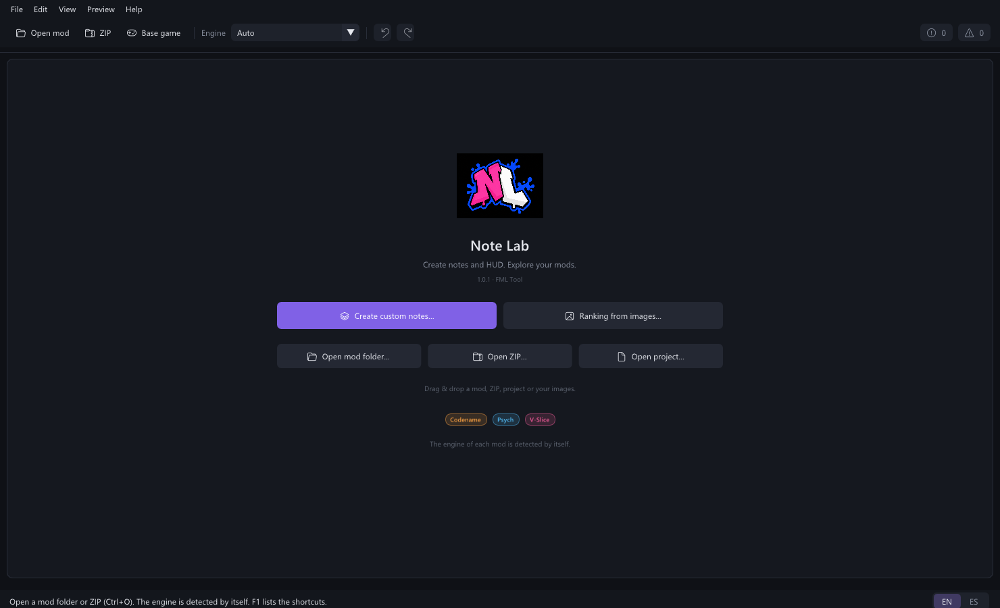
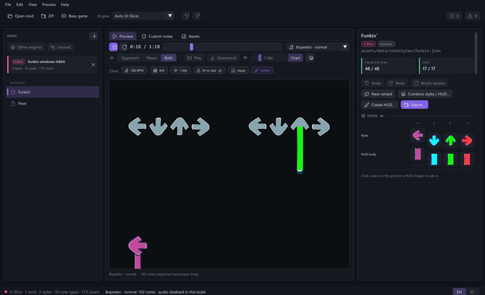
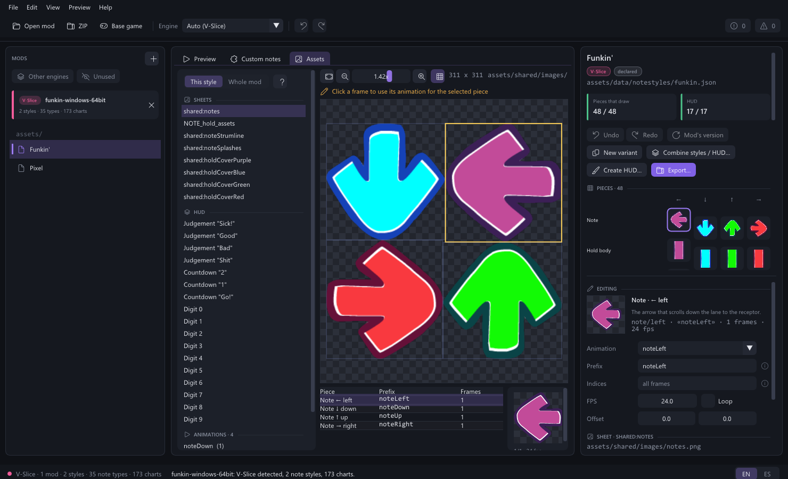
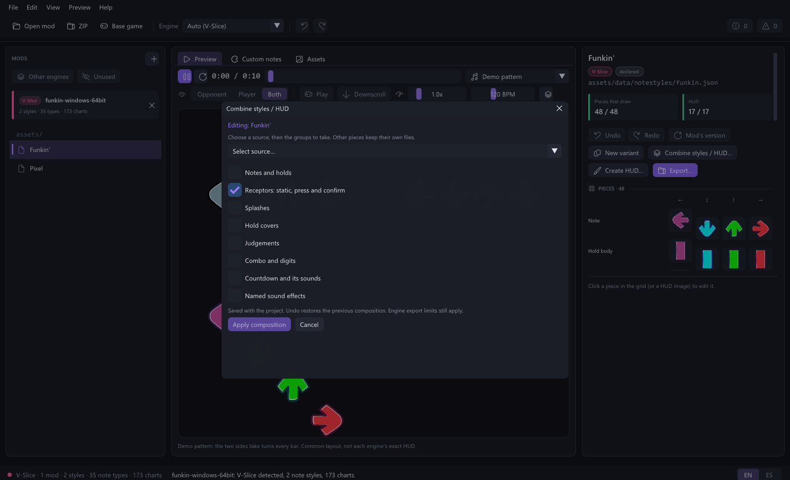
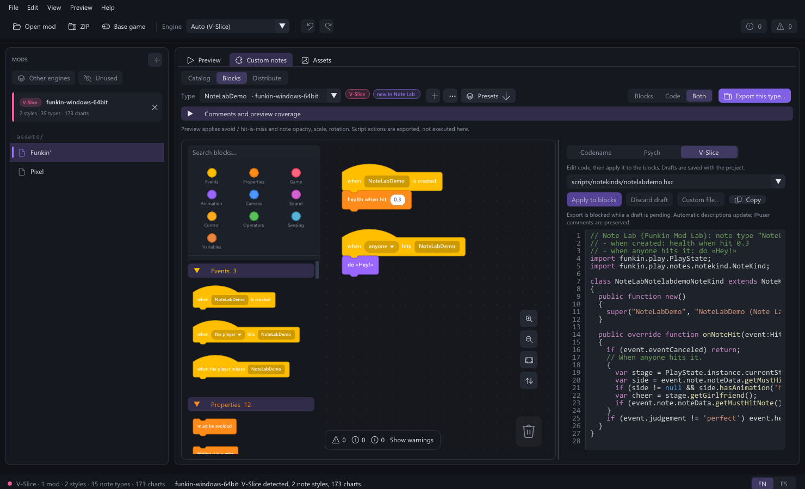

<div align="center">


# Note Lab · FML Tool

**Your notes. Your HUD. Your custom-note behavior.**


[Get started](#get-started) · [Screenshots](#the-base-game-inside-note-lab) · [Blocks & code](#blocks-and-code) · [Build](#build-and-test) · [Limits](#important-limits)

</div>

Note Lab is an independent FML tool built on its shared note-editing core.
It runs without installing the full suite. English and Spanish are included;
English is the default.

Create from your own images or remix individual components of an existing
style. Inspect the frames, try a chart, build behavior with blocks and export
an engine-specific package with installation instructions.

**This build is completely silent.** There is no sound-enable option. Charts
and animations keep running, and OGG resources can still be imported and
exported; neither song playback nor editor cues produce audio.



## Get started

Extract the **whole public ZIP**, keep `SDL3.dll` beside `NoteLab.exe`, and run
`NoteLab.exe`. Windows x64 and an OpenGL 3.3-capable graphics driver are required.
No Python, Haxe, Node.js or Visual Studio installation is needed to run it.

1. Choose **Create custom notes** to start from your own files, or open a mod
   folder, ZIP or `.fmlnote` project. Up to four sources can be open together.
2. Choose a style on the left. Preview, Custom notes and Assets use the same
   project. The inspector shows the selected style and its editable pieces.
3. Use **Combine styles / HUD** to take only notes, receptors, splashes,
   covers, ranking, countdown or sounds from another style. Combine several
   sources in successive steps without replacing the unselected groups.
4. Save your project with **Ctrl+S**. Export a folder or ZIP for the chosen
   engine with **Ctrl+E**, then follow the generated installation guide.

## The base game inside Note Lab

These are real captures of Note Lab with locally installed base-game assets,
not mockups or AI artwork. The game files are **not included** in either ZIP.

### Preview a chart and its HUD



Inspect both sides, switch scroll direction and play the chart silently.
Separate note and receptor files remain separate components: a partial sheet
does not hide the base receptors.

### Inspect the actual spritesheet



See the source sheet, animation bounds and frames before changing a resource.
The advanced creator accepts PNGs, XML/TXT sheets, sequences, manual regions
and grid cells instead of restricting you to a supplied template.

### Combine the pieces you need



Take only receptors, notes, splashes, hold covers, ranking, countdown or named
sounds. The other groups stay unchanged; save the composition in your project.

## Blocks and code

Build custom-note behavior with blocks, edit the generated code with syntax
colors, then apply supported code changes back to the blocks. Comments and
drafts stay with the project. Unsupported code remains explicitly custom;
it is not silently shown as equivalent editable blocks.



## Features

- Native Codename, Psych and V-Slice style, custom-note and chart readers.
- Basic painting and an advanced creator for PNG, XML/TXT atlases, PNG
  sequences, GIF inputs, manual crops/grid cells and OGG audio assignments.
- Independent notes, receptors, holds, splashes and HUD files. Partial note
  sheets retain base receptors in preview rather than making them disappear.
- Image-based ranking, countdown and named sound effects. No AI-generated
  artwork or bundled game assets. The old text-ranking creator stays hidden.
- Custom-note blocks, presets, editable generated code, syntax colors,
  comments, bounded code-to-block synchronization and undo/redo.
- Deterministic custom-note distributions, exact quantities, filters and
  a per-type/per-side preview bot.
- Save a distribution as a native chart copy or explicitly replace a mod
  chart with a unique backup and an external-change check.
- Structurally checked folder/ZIP export for Codename, Psych and V-Slice, with engine
  capability warnings and English/Spanish installation instructions.
- Resizable panels, compact inspector tab, source-close confirmation and
  bounded, atomic `.fmlnote` saving with Unicode path support.

## Important limits

Audio is disabled for this public build, including imported-file audition.
The shared audio implementation remains in the source for other FML hosts;
changing saved preferences cannot reactivate it in Note Lab.

Preview is **not the game engine**: it does not execute arbitrary mod scripts
or simulate every exported block. The interface reports coverage. An export
passing structural re-reading is not a certification of in-game execution.

HUD layout offsets in the preview are **preview-only**, not a complete exported
HUD layout system. Native ranking/countdown images are static; animation is
not silently promised for engines that cannot express it. Audio export requires
OGG Vorbis. Per-note-type exports do not replace a whole strumline's receptors.

Projects reference source mods and cached imported/generated media. They are
**not portable bundles** yet. Do not delete or move those folders. Missing
source mods block opening without discarding the current project; missing
imported media is reported. Keep the project and its source/cache together.

Mod assets are read-only. Chart replacement is a separate explicit operation;
ZIPs and base-game charts are protected. Back up your mods before installing
an exported package. Note Lab does not redistribute the assets you open.

## Build and test

The developer ZIP includes all required shared source and vendored libraries;
it does not need a sibling FML checkout. Install Visual Studio C++ x64 build
tools and a Windows SDK, then run:

```bat
build.bat
test.bat
test-workflow.bat
powershell -File test-ui.ps1
```

Output: `build/app/NoteLab.exe` and `SDL3.dll`. All units are rebuilt with
static C++ runtime linkage; no stale-object shortcut is used. The SDL DLL is
still required. `test.bat` runs synthetic core regression tests without mods.
The workflow test generates a broad creation/export/code matrix in `.qa/`:
six image-input modes, 16/32 cells, every component role, cross-engine exports,
all block presets, code/comment roundtrips and error handling.
The native UI test requires an OpenGL-capable desktop and the workflow fixtures;
CI builds the app and core tests, but does not claim graphics/UI coverage.

`test-engines.ps1 -Codename <folder> -Psych <folder> -VSlice <folder>` prepares
isolated game copies, leaving the originals untouched. Native launch is a
separate step: a successful copy or file re-read is not proof that a song ran.
Read the [verification report](docs/RELEASE_CHECKS.md) for the actual results.

The developer kit contains the **Note Lab dependency closure**, not the whole
FML suite. Core behavior lives in `src/fml_notelab`; the desktop UI lives in
`NoteLab/src`. The supplied logo is embedded into the executable and included
in `assets/`. `prepare-assets.ps1` rebuilds the multi-size Windows icon from
that original PNG; it does not generate new artwork.

Read [architecture and module map](docs/MODULES.md),
[shared-core synchronization](docs/CORE_SYNC.md),
[public-build verification](docs/RELEASE_CHECKS.md),
[change log](CHANGELOG.md) and [development log](BITACORA.md).

## License and contributing

Note Lab/FML source: [MIT](LICENSE). See [dependency notices](THIRD_PARTY_NOTICES.md).
The license does not include game/mod assets or system fonts.
See [contributing](CONTRIBUTING.md) and [security reporting](SECURITY.md).

## Español

Note Lab es una herramienta independiente de FML para crear, inspeccionar y
exportar notas y recursos del HUD. No necesitas instalar la suite completa.
La interfaz arranca en inglés; puedes cambiar a español y guardar la preferencia.

Esta build permanece **silenciada al 100 %, sin opción para activar sonido**.
Los charts y las animaciones funcionan; importar y exportar OGG sigue permitido.
Consulta el [inicio rápido en español](docs/QUICKSTART_ES.md), los
[resultados de pruebas](docs/RELEASE_CHECKS.md) y la [bitácora](BITACORA.md).

